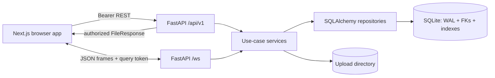

# Independent Repository Audit — Signal Clone

**Target:** local `main` at `3092271` (2026-10-09); independent review. **Mode:** read-only except this report. No GitHub/cloud/deployment service was contacted. The only intended repository mutation is this report and its requested commit. `wip-panels-mobile` was inspected separately.

Evidence labels: **PASS** means a named automated check or live probe passed; **FAIL** means reproduced failure; **PARTIAL** means only part was proved; **UNVERIFIED** means code inspection or unavailable checks are insufficient. Signal Desktop exact-reference comparisons are approximate because `docs/reference/` is absent and no reference app was captured.

## 1. Executive summary

| Criterion | Weight | Score | Evidence / reason |
|---|---:|---:|---|
| Functionality | 30 | 24 | REST/WS smoke and restart persistence passed; tests cover concurrency, receipts, authorization and expiry. Browser suite 22/25; several adversarial paths remain untested. |
| UI/UX similarity | 20 | 8 | App captures exist at 375/768/1280 and both themes. Only selected captures visually inspected; no Signal references. Broad messenger structure exists; parity unproved. |
| Database | 10 | 9 | Ten ORM tables, constraints/FKs/indexes, fresh schema parity test, runtime FK/WAL/30s busy timeout. No migration lifecycle. |
| Backend/API | 10 | 8 | API/service/repository/model split and protected media; smoke passed. Process-local rate limits, OTP hint, and query/transaction risks remain. |
| Code quality | 10 | 7 | Format/lint/typecheck/build passed in a clean archive; browser suite has 3 failures and large files remain. |
| Modularity | 10 | 7 | Feature folders/hooks/services exist, but 6 source/test files exceed 300 lines. |
| Deliverables/docs/deployment | 10 | 4 | README/DEPLOY/CI/config exist. Clean clone and hosted demo not verified; free Render storage is ephemeral. |
| **Total** | **100** | **67** | Weighted sum. **NO-GO** until E2E failures are fixed, visual reference comparison is done, and the deliverable is verified. |

### Top 15 problems

1. **HIGH — browser suite not green:** `npm run test:e2e -- --reporter=line` produced 22 passed / 3 failed of 25 in 2m18s. Failures concern cold-start status, conversation-list failure/retry alert, and expired REST-session return (`frontend/e2e/layout.spec.ts`).
2. **HIGH — no reference evidence for “exact Signal”:** no `docs/reference/`; app screenshots do not prove similarity.
3. **HIGH — three error/wakeup assertions unresolved:** must diagnose traces and fix underlying state behavior; not count as passed.
4. **HIGH — no hosted demo verified:** README has no deployed URL; no cloud access. A local origin string does not prove visibility/reachability.
5. **HIGH — OTP is public/demo-grade:** `backend/app/services/auth_service.py:13-16` returns fixed `Use 123456` hint.
6. **HIGH — throttling is process-local:** `backend/app/core/rate_limit.py:9-37` is an in-memory dict; limits reset on restart and do not coordinate across workers.
7. **MEDIUM — no phone canonicalization:** lookup is exact (`user_repository.py:11-14`, `auth_service.py:19-36`); equivalent formats may create separate accounts. Limiter normalization is not persistence normalization.
8. **MEDIUM — retry/failure/expired-session flows have reproducible browser failures**, contrary to blanket “all green” documentation.
9. **MEDIUM — Render free tier loses user DB/uploads on restart:** documented; startup reseeds demos, not user data.
10. **MEDIUM — no message-send abuse limit found:** body max 10,000 chars, uploads max 10MiB; no per-user message-rate bound.
11. **MEDIUM — endpoint upload cap occurs after multipart handling begins:** handler reads max+1 (`upload_service.py:51-58`), but server/proxy total request cap is not configured here.
12. **MEDIUM — adversarial download filename/header cases not specifically tested:** `FileResponse(...filename=...)` is used after basename sanitization.
13. **MEDIUM — oversized code/tests:** E2E layout spec 573 lines, concurrency script 413, GroupInfoPanel 372, message service 306, AUDIT.md 310, chat.css 301.
14. **LOW — unused `python-jose[cryptography]`:** requirements pin it but no jose import exists; tokens are opaque and hashed.
15. **LOW — verification gaps:** local clean clone failed at Git/MSYS startup, npm audit hit registry DNS, pip-audit is absent; mark all UNVERIFIED.

## 2. Complete file and folder inventory

Inventory is derived from `git ls-files` on main. Pre-report `git status --short --branch --ignored` showed no modified or non-ignored untracked files. Thus the path table below covers all tracked files and all non-generated, non-ignored worktree files (none). Build outputs/caches are excluded as requested. `docs/reference/` is absent.

### Tree

The complete 211-path source tree is the `Path` column in the inventory table below. It includes root docs/config, `backend/` API/services/repositories/models/schemas/WS/DB/scripts/tests and `frontend/` routes/components/hooks/lib/stores/types/styles/e2e/assets. Ignored generated files are recorded after the table.

### Every tracked file

| `.github/workflows/ci.yml` | Repository config or submission documentation | YAML | 37 | 950 | tracked | 3092271 | KEEP — Active source, test, config, dependency, documentation, or referenced asset; no proven dead reference. |
| `.gitignore` | Repository config or submission documentation | Git ignore | 26 | 412 | tracked | bb26ded | KEEP — Active source, test, config, dependency, documentation, or referenced asset; no proven dead reference. |
| `.nvmrc` | Repository config or submission documentation | Runtime pin | 1 | 4 | tracked | 3092271 | KEEP — Active source, test, config, dependency, documentation, or referenced asset; no proven dead reference. |
| `AUDIT.md` | Repository config or submission documentation | Markdown | 310 | 52162 | tracked | 59bc8a1 | MERGE — Historical process/audit overlap and stale claims; consolidate verified content in README/DEPLOY/report. |
| `DEPLOY.md` | Repository config or submission documentation | Markdown | 71 | 7951 | tracked | c44f130 | KEEP — Active source, test, config, dependency, documentation, or referenced asset; no proven dead reference. |
| `GAPS.md` | Repository config or submission documentation | Markdown | 17 | 2520 | tracked | 7d4e886 | MERGE — Historical process/audit overlap and stale claims; consolidate verified content in README/DEPLOY/report. |
| `INTERVIEW_NOTES.md` | Repository config or submission documentation | Markdown | 33 | 6867 | tracked | 59bc8a1 | MERGE — Historical process/audit overlap and stale claims; consolidate verified content in README/DEPLOY/report. |
| `PROGRESS.md` | Repository config or submission documentation | Markdown | 84 | 12948 | tracked | 59bc8a1 | MERGE — Historical process/audit overlap and stale claims; consolidate verified content in README/DEPLOY/report. |
| `README.md` | Repository config or submission documentation | Markdown | 275 | 17518 | tracked | f738682 | KEEP — Active source, test, config, dependency, documentation, or referenced asset; no proven dead reference. |
| `STATUS.md` | Repository config or submission documentation | Markdown | 184 | 25485 | tracked | f738682 | MERGE — Historical process/audit overlap and stale claims; consolidate verified content in README/DEPLOY/report. |
| `backend/.env.example` | Backend app/test/script/tooling | Other | — | 260 | tracked | 372d1cb | KEEP — Active source, test, config, dependency, documentation, or referenced asset; no proven dead reference. |
| `backend/.python-version` | Backend app/test/script/tooling | Other | — | 5 | tracked | 372d1cb | KEEP — Active source, test, config, dependency, documentation, or referenced asset; no proven dead reference. |
| `backend/Dockerfile` | Backend app/test/script/tooling | Other | — | 236 | tracked | b8eb3bd | UNSURE — Optional container path unused by documented README/Render workflow; clarify or remove. |
| `backend/app/__init__.py` | Backend app/test/script/tooling | Python | 0 | 0 | tracked | ad86a60 | KEEP — Active source, test, config, dependency, documentation, or referenced asset; no proven dead reference. |
| `backend/app/api/v1/auth.py` | Backend app/test/script/tooling | Python | 46 | 2229 | tracked | 91d645e | KEEP — Active source, test, config, dependency, documentation, or referenced asset; no proven dead reference. |
| `backend/app/api/v1/contacts.py` | Backend app/test/script/tooling | Python | 56 | 2143 | tracked | ccf0e3c | KEEP — Active source, test, config, dependency, documentation, or referenced asset; no proven dead reference. |
| `backend/app/api/v1/conversations.py` | Backend app/test/script/tooling | Python | 54 | 2262 | tracked | 67c83f8 | KEEP — Active source, test, config, dependency, documentation, or referenced asset; no proven dead reference. |
| `backend/app/api/v1/groups.py` | Backend app/test/script/tooling | Python | 69 | 2805 | tracked | ccf0e3c | KEEP — Active source, test, config, dependency, documentation, or referenced asset; no proven dead reference. |
| `backend/app/api/v1/media.py` | Backend app/test/script/tooling | Python | 31 | 1264 | tracked | f5186df | KEEP — Active source, test, config, dependency, documentation, or referenced asset; no proven dead reference. |
| `backend/app/api/v1/messages.py` | Backend app/test/script/tooling | Python | 56 | 2275 | tracked | 900f188 | KEEP — Active source, test, config, dependency, documentation, or referenced asset; no proven dead reference. |
| `backend/app/api/v1/router.py` | Backend app/test/script/tooling | Python | 11 | 451 | tracked | ccf0e3c | KEEP — Active source, test, config, dependency, documentation, or referenced asset; no proven dead reference. |
| `backend/app/api/v1/uploads.py` | Backend app/test/script/tooling | Python | 15 | 590 | tracked | 2f25366 | KEEP — Active source, test, config, dependency, documentation, or referenced asset; no proven dead reference. |
| `backend/app/api/v1/users.py` | Backend app/test/script/tooling | Python | 32 | 1295 | tracked | 67c83f8 | KEEP — Active source, test, config, dependency, documentation, or referenced asset; no proven dead reference. |
| `backend/app/core/config.py` | Backend app/test/script/tooling | Python | 34 | 1349 | tracked | 91d645e | KEEP — Active source, test, config, dependency, documentation, or referenced asset; no proven dead reference. |
| `backend/app/core/datetime.py` | Backend app/test/script/tooling | Python | 8 | 353 | tracked | 900f188 | KEEP — Active source, test, config, dependency, documentation, or referenced asset; no proven dead reference. |
| `backend/app/core/deps.py` | Backend app/test/script/tooling | Python | 15 | 668 | tracked | 10ea8b4 | KEEP — Active source, test, config, dependency, documentation, or referenced asset; no proven dead reference. |
| `backend/app/core/logging.py` | Backend app/test/script/tooling | Python | 3 | 157 | tracked | 75b0c2d | KEEP — Active source, test, config, dependency, documentation, or referenced asset; no proven dead reference. |
| `backend/app/core/rate_limit.py` | Backend app/test/script/tooling | Python | 33 | 1485 | tracked | 91d645e | KEEP — Active source, test, config, dependency, documentation, or referenced asset; no proven dead reference. |
| `backend/app/core/security.py` | Backend app/test/script/tooling | Python | 6 | 203 | tracked | 75b0c2d | KEEP — Active source, test, config, dependency, documentation, or referenced asset; no proven dead reference. |
| `backend/app/db/base.py` | Backend app/test/script/tooling | Python | 9 | 262 | tracked | 75b0c2d | KEEP — Active source, test, config, dependency, documentation, or referenced asset; no proven dead reference. |
| `backend/app/db/seed.py` | Backend app/test/script/tooling | Python | 201 | 8905 | tracked | 1f13345 | KEEP — Active source, test, config, dependency, documentation, or referenced asset; no proven dead reference. |
| `backend/app/db/session.py` | Backend app/test/script/tooling | Python | 25 | 986 | tracked | 455115f | KEEP — Active source, test, config, dependency, documentation, or referenced asset; no proven dead reference. |
| `backend/app/main.py` | Backend app/test/script/tooling | Python | 91 | 3810 | tracked | 4797701 | KEEP — Active source, test, config, dependency, documentation, or referenced asset; no proven dead reference. |
| `backend/app/models/__init__.py` | Backend app/test/script/tooling | Python | 10 | 448 | tracked | 75b0c2d | KEEP — Active source, test, config, dependency, documentation, or referenced asset; no proven dead reference. |
| `backend/app/models/auth.py` | Backend app/test/script/tooling | Python | 22 | 1391 | tracked | 75b0c2d | KEEP — Active source, test, config, dependency, documentation, or referenced asset; no proven dead reference. |
| `backend/app/models/contact.py` | Backend app/test/script/tooling | Python | 17 | 1017 | tracked | 75b0c2d | KEEP — Active source, test, config, dependency, documentation, or referenced asset; no proven dead reference. |
| `backend/app/models/conversation.py` | Backend app/test/script/tooling | Python | 39 | 2560 | tracked | 75b0c2d | KEEP — Active source, test, config, dependency, documentation, or referenced asset; no proven dead reference. |
| `backend/app/models/message.py` | Backend app/test/script/tooling | Python | 55 | 3677 | tracked | 2f25366 | KEEP — Active source, test, config, dependency, documentation, or referenced asset; no proven dead reference. |
| `backend/app/models/user.py` | Backend app/test/script/tooling | Python | 19 | 1265 | tracked | ccf0e3c | KEEP — Active source, test, config, dependency, documentation, or referenced asset; no proven dead reference. |
| `backend/app/repositories/__init__.py` | Backend app/test/script/tooling | Python | 7 | 349 | tracked | 2f25366 | KEEP — Active source, test, config, dependency, documentation, or referenced asset; no proven dead reference. |
| `backend/app/repositories/attachment_repository.py` | Backend app/test/script/tooling | Python | 7 | 381 | tracked | 2f25366 | KEEP — Active source, test, config, dependency, documentation, or referenced asset; no proven dead reference. |
| `backend/app/repositories/auth_repository.py` | Backend app/test/script/tooling | Python | 15 | 679 | tracked | 262f6a7 | KEEP — Active source, test, config, dependency, documentation, or referenced asset; no proven dead reference. |
| `backend/app/repositories/contact_repository.py` | Backend app/test/script/tooling | Python | 17 | 932 | tracked | ccf0e3c | KEEP — Active source, test, config, dependency, documentation, or referenced asset; no proven dead reference. |
| `backend/app/repositories/conversation_repository.py` | Backend app/test/script/tooling | Python | 39 | 1438 | tracked | e3ab648 | KEEP — Active source, test, config, dependency, documentation, or referenced asset; no proven dead reference. |
| `backend/app/repositories/message_repository.py` | Backend app/test/script/tooling | Python | 32 | 1642 | tracked | 455115f | KEEP — Active source, test, config, dependency, documentation, or referenced asset; no proven dead reference. |
| `backend/app/repositories/receipt_repository.py` | Backend app/test/script/tooling | Python | 12 | 431 | tracked | 75b0c2d | KEEP — Active source, test, config, dependency, documentation, or referenced asset; no proven dead reference. |
| `backend/app/repositories/user_repository.py` | Backend app/test/script/tooling | Python | 20 | 818 | tracked | 75b0c2d | KEEP — Active source, test, config, dependency, documentation, or referenced asset; no proven dead reference. |
| `backend/app/schemas/__init__.py` | Backend app/test/script/tooling | Python | 11 | 699 | tracked | 2f25366 | KEEP — Active source, test, config, dependency, documentation, or referenced asset; no proven dead reference. |
| `backend/app/schemas/attachment.py` | Backend app/test/script/tooling | Python | 7 | 149 | tracked | 2f25366 | KEEP — Active source, test, config, dependency, documentation, or referenced asset; no proven dead reference. |
| `backend/app/schemas/auth.py` | Backend app/test/script/tooling | Python | 15 | 486 | tracked | 75b0c2d | KEEP — Active source, test, config, dependency, documentation, or referenced asset; no proven dead reference. |
| `backend/app/schemas/conversation.py` | Backend app/test/script/tooling | Python | 31 | 1324 | tracked | 67c83f8 | KEEP — Active source, test, config, dependency, documentation, or referenced asset; no proven dead reference. |
| `backend/app/schemas/message.py` | Backend app/test/script/tooling | Python | 28 | 987 | tracked | 2c842a7 | KEEP — Active source, test, config, dependency, documentation, or referenced asset; no proven dead reference. |
| `backend/app/schemas/user.py` | Backend app/test/script/tooling | Python | 20 | 721 | tracked | 900f188 | KEEP — Active source, test, config, dependency, documentation, or referenced asset; no proven dead reference. |
| `backend/app/schemas/ws.py` | Backend app/test/script/tooling | Python | 4 | 166 | tracked | 75b0c2d | KEEP — Active source, test, config, dependency, documentation, or referenced asset; no proven dead reference. |
| `backend/app/services/auth_service.py` | Backend app/test/script/tooling | Python | 70 | 3113 | tracked | ccf0e3c | KEEP — Active source, test, config, dependency, documentation, or referenced asset; no proven dead reference. |
| `backend/app/services/contact_service.py` | Backend app/test/script/tooling | Python | 87 | 3592 | tracked | 7c23b75 | KEEP — Active source, test, config, dependency, documentation, or referenced asset; no proven dead reference. |
| `backend/app/services/conversation_service.py` | Backend app/test/script/tooling | Python | 201 | 9877 | tracked | 67c83f8 | KEEP — Active source, test, config, dependency, documentation, or referenced asset; no proven dead reference. |
| `backend/app/services/disappearing_service.py` | Backend app/test/script/tooling | Python | 30 | 1211 | tracked | ccf0e3c | KEEP — Active source, test, config, dependency, documentation, or referenced asset; no proven dead reference. |
| `backend/app/services/group_service.py` | Backend app/test/script/tooling | Python | 140 | 7267 | tracked | ccf0e3c | KEEP — Active source, test, config, dependency, documentation, or referenced asset; no proven dead reference. |
| `backend/app/services/media_service.py` | Backend app/test/script/tooling | Python | 68 | 3701 | tracked | f5186df | KEEP — Active source, test, config, dependency, documentation, or referenced asset; no proven dead reference. |
| `backend/app/services/message_service.py` | Backend app/test/script/tooling | Python | 306 | 13837 | tracked | 900f188 | KEEP — Active source, test, config, dependency, documentation, or referenced asset; no proven dead reference. |
| `backend/app/services/presence_service.py` | Backend app/test/script/tooling | Python | 32 | 1400 | tracked | ccf0e3c | KEEP — Active source, test, config, dependency, documentation, or referenced asset; no proven dead reference. |
| `backend/app/services/presentation_service.py` | Backend app/test/script/tooling | Python | 15 | 567 | tracked | 900f188 | KEEP — Active source, test, config, dependency, documentation, or referenced asset; no proven dead reference. |
| `backend/app/services/realtime_service.py` | Backend app/test/script/tooling | Python | 146 | 5682 | tracked | 900f188 | KEEP — Active source, test, config, dependency, documentation, or referenced asset; no proven dead reference. |
| `backend/app/services/receipt_service.py` | Backend app/test/script/tooling | Python | 4 | 284 | tracked | 75b0c2d | KEEP — Active source, test, config, dependency, documentation, or referenced asset; no proven dead reference. |
| `backend/app/services/upload_service.py` | Backend app/test/script/tooling | Python | 96 | 4555 | tracked | f5186df | KEEP — Active source, test, config, dependency, documentation, or referenced asset; no proven dead reference. |
| `backend/app/services/user_service.py` | Backend app/test/script/tooling | Python | 5 | 255 | tracked | 75b0c2d | KEEP — Active source, test, config, dependency, documentation, or referenced asset; no proven dead reference. |
| `backend/app/ws/__init__.py` | Backend app/test/script/tooling | Python | 2 | 56 | tracked | 75b0c2d | KEEP — Active source, test, config, dependency, documentation, or referenced asset; no proven dead reference. |
| `backend/app/ws/events.py` | Backend app/test/script/tooling | Python | 12 | 374 | tracked | 262f6a7 | KEEP — Active source, test, config, dependency, documentation, or referenced asset; no proven dead reference. |
| `backend/app/ws/manager.py` | Backend app/test/script/tooling | Python | 75 | 3295 | tracked | ccf0e3c | KEEP — Active source, test, config, dependency, documentation, or referenced asset; no proven dead reference. |
| `backend/app/ws/router.py` | Backend app/test/script/tooling | Python | 128 | 5932 | tracked | 455115f | KEEP — Active source, test, config, dependency, documentation, or referenced asset; no proven dead reference. |
| `backend/pyproject.toml` | Backend app/test/script/tooling | TOML | 6 | 115 | tracked | b8eb3bd | KEEP — Active source, test, config, dependency, documentation, or referenced asset; no proven dead reference. |
| `backend/pytest.ini` | Backend app/test/script/tooling | Other | — | 57 | tracked | 0a1d7fa | KEEP — Active source, test, config, dependency, documentation, or referenced asset; no proven dead reference. |
| `backend/requirements.txt` | Backend app/test/script/tooling | Text | 9 | 189 | tracked | 0a1d7fa | KEEP — Active source, test, config, dependency, documentation, or referenced asset; no proven dead reference. |
| `backend/scripts/concurrency_test.py` | Backend app/test/script/tooling | Python | 413 | 20976 | tracked | 036e5c4 | KEEP — Active source, test, config, dependency, documentation, or referenced asset; no proven dead reference. |
| `backend/scripts/smoke_e2e.py` | Backend app/test/script/tooling | Python | 127 | 6792 | tracked | 4797701 | KEEP — Active source, test, config, dependency, documentation, or referenced asset; no proven dead reference. |
| `backend/tests/audit_helpers.py` | Backend app/test/script/tooling | Python | 10 | 461 | tracked | ccf0e3c | KEEP — Active source, test, config, dependency, documentation, or referenced asset; no proven dead reference. |
| `backend/tests/conftest.py` | Backend app/test/script/tooling | Python | 42 | 1243 | tracked | 2c842a7 | KEEP — Active source, test, config, dependency, documentation, or referenced asset; no proven dead reference. |
| `backend/tests/test_audit_conversation_queries.py` | Backend app/test/script/tooling | Python | 29 | 1368 | tracked | ccf0e3c | KEEP — Active source, test, config, dependency, documentation, or referenced asset; no proven dead reference. |
| `backend/tests/test_audit_direct_creation.py` | Backend app/test/script/tooling | Python | 38 | 1768 | tracked | ccf0e3c | KEEP — Active source, test, config, dependency, documentation, or referenced asset; no proven dead reference. |
| `backend/tests/test_audit_group_lifecycle.py` | Backend app/test/script/tooling | Python | 42 | 1959 | tracked | ccf0e3c | KEEP — Active source, test, config, dependency, documentation, or referenced asset; no proven dead reference. |
| `backend/tests/test_audit_layering.py` | Backend app/test/script/tooling | Python | 4 | 240 | tracked | ccf0e3c | KEEP — Active source, test, config, dependency, documentation, or referenced asset; no proven dead reference. |
| `backend/tests/test_audit_privacy_media.py` | Backend app/test/script/tooling | Python | 106 | 5667 | tracked | ccf0e3c | KEEP — Active source, test, config, dependency, documentation, or referenced asset; no proven dead reference. |
| `backend/tests/test_audit_websocket_cleanup.py` | Backend app/test/script/tooling | Python | 32 | 1453 | tracked | ccf0e3c | KEEP — Active source, test, config, dependency, documentation, or referenced asset; no proven dead reference. |
| `backend/tests/test_auth_security.py` | Backend app/test/script/tooling | Python | 38 | 1926 | tracked | 91d645e | KEEP — Active source, test, config, dependency, documentation, or referenced asset; no proven dead reference. |
| `backend/tests/test_concurrency.py` | Backend app/test/script/tooling | Python | 197 | 9296 | tracked | 79ba8a2 | KEEP — Active source, test, config, dependency, documentation, or referenced asset; no proven dead reference. |
| `backend/tests/test_contact_ordering.py` | Backend app/test/script/tooling | Python | 35 | 1167 | tracked | 7c23b75 | KEEP — Active source, test, config, dependency, documentation, or referenced asset; no proven dead reference. |
| `backend/tests/test_core.py` | Backend app/test/script/tooling | Python | 112 | 5560 | tracked | 38d5b01 | KEEP — Active source, test, config, dependency, documentation, or referenced asset; no proven dead reference. |
| `backend/tests/test_core_groups.py` | Backend app/test/script/tooling | Python | 99 | 4894 | tracked | 38d5b01 | KEEP — Active source, test, config, dependency, documentation, or referenced asset; no proven dead reference. |
| `backend/tests/test_core_lifecycle.py` | Backend app/test/script/tooling | Python | 88 | 5172 | tracked | 4797701 | KEEP — Active source, test, config, dependency, documentation, or referenced asset; no proven dead reference. |
| `backend/tests/test_core_uploads.py` | Backend app/test/script/tooling | Python | 126 | 6281 | tracked | f5186df | KEEP — Active source, test, config, dependency, documentation, or referenced asset; no proven dead reference. |
| `backend/tests/test_core_websocket.py` | Backend app/test/script/tooling | Python | 93 | 4881 | tracked | 38d5b01 | KEEP — Active source, test, config, dependency, documentation, or referenced asset; no proven dead reference. |
| `backend/tests/test_datetime_serialization.py` | Backend app/test/script/tooling | Python | 86 | 3934 | tracked | 900f188 | KEEP — Active source, test, config, dependency, documentation, or referenced asset; no proven dead reference. |
| `backend/tests/test_fresh_schema.py` | Backend app/test/script/tooling | Python | 40 | 2178 | tracked | 38d5b01 | KEEP — Active source, test, config, dependency, documentation, or referenced asset; no proven dead reference. |
| `docker-compose.yml` | Repository config or submission documentation | YAML | 17 | 473 | tracked | b8eb3bd | UNSURE — Optional container path unused by documented README/Render workflow; clarify or remove. |
| `docs/PARITY.md` | Documentation or curated visual asset | Markdown | 56 | 12081 | tracked | f738682 | MERGE — Historical process/audit overlap and stale claims; consolidate verified content in README/DEPLOY/report. |
| `docs/screenshots/README.md` | Documentation or curated visual asset | Markdown | 11 | 1045 | tracked | f738682 | KEEP — Active source, test, config, dependency, documentation, or referenced asset; no proven dead reference. |
| `docs/screenshots/curated/390-light-chat-list.png` | Documentation or curated visual asset | PNG | — | 52614 | tracked | f738682 | KEEP — Small explicit curated screenshot set. |
| `docs/screenshots/curated/412-dark-info.png` | Documentation or curated visual asset | PNG | — | 105648 | tracked | f738682 | KEEP — Small explicit curated screenshot set. |
| `docs/screenshots/curated/dark-1280-settings.png` | Documentation or curated visual asset | PNG | — | 126031 | tracked | f738682 | KEEP — Small explicit curated screenshot set. |
| `docs/screenshots/curated/dark-375-chat.png` | Documentation or curated visual asset | PNG | — | 57703 | tracked | f738682 | KEEP — Small explicit curated screenshot set. |
| `docs/screenshots/curated/light-1280-group-info.png` | Documentation or curated visual asset | PNG | — | 168532 | tracked | f738682 | KEEP — Small explicit curated screenshot set. |
| `docs/screenshots/curated/light-375-conversation-list.png` | Documentation or curated visual asset | PNG | — | 73687 | tracked | f738682 | KEEP — Small explicit curated screenshot set. |
| `docs/screenshots/curated/light-375-new-chat.png` | Documentation or curated visual asset | PNG | — | 47697 | tracked | f738682 | KEEP — Small explicit curated screenshot set. |
| `frontend/.env.example` | Frontend app/test/style/tooling/asset | Other | — | 92 | tracked | b8eb3bd | KEEP — Active source, test, config, dependency, documentation, or referenced asset; no proven dead reference. |
| `frontend/.eslintrc.json` | Frontend app/test/style/tooling/asset | JSON | 3 | 41 | tracked | b8eb3bd | KEEP — Active source, test, config, dependency, documentation, or referenced asset; no proven dead reference. |
| `frontend/.prettierrc.json` | Frontend app/test/style/tooling/asset | JSON | 6 | 90 | tracked | b8eb3bd | KEEP — Active source, test, config, dependency, documentation, or referenced asset; no proven dead reference. |
| `frontend/Dockerfile` | Frontend app/test/style/tooling/asset | Other | — | 132 | tracked | 0a097e2 | UNSURE — Optional container path unused by documented README/Render workflow; clarify or remove. |
| `frontend/e2e/attachment-download.spec.ts` | Frontend app/test/style/tooling/asset | TypeScript | 79 | 4032 | tracked | f5186df | KEEP — Active source, test, config, dependency, documentation, or referenced asset; no proven dead reference. |
| `frontend/e2e/chatTestHelpers.ts` | Frontend app/test/style/tooling/asset | TypeScript | 68 | 2838 | tracked | 900f188 | KEEP — Active source, test, config, dependency, documentation, or referenced asset; no proven dead reference. |
| `frontend/e2e/concurrency.spec.ts` | Frontend app/test/style/tooling/asset | TypeScript | 141 | 5914 | tracked | c696c15 | KEEP — Active source, test, config, dependency, documentation, or referenced asset; no proven dead reference. |
| `frontend/e2e/conversation-preview.spec.ts` | Frontend app/test/style/tooling/asset | TypeScript | 59 | 2711 | tracked | c696c15 | KEEP — Active source, test, config, dependency, documentation, or referenced asset; no proven dead reference. |
| `frontend/e2e/datetime.spec.ts` | Frontend app/test/style/tooling/asset | TypeScript | 73 | 3413 | tracked | 900f188 | KEEP — Active source, test, config, dependency, documentation, or referenced asset; no proven dead reference. |
| `frontend/e2e/layout.spec.ts` | Frontend app/test/style/tooling/asset | TypeScript | 573 | 26696 | tracked | b065900 | KEEP — Active source, test, config, dependency, documentation, or referenced asset; no proven dead reference. |
| `frontend/e2e/mobile-panels.spec.ts` | Frontend app/test/style/tooling/asset | TypeScript | 142 | 6933 | tracked | c696c15 | KEEP — Active source, test, config, dependency, documentation, or referenced asset; no proven dead reference. |
| `frontend/e2e/z-flows.spec.ts` | Frontend app/test/style/tooling/asset | TypeScript | 142 | 6321 | tracked | b8d3e5f | KEEP — Active source, test, config, dependency, documentation, or referenced asset; no proven dead reference. |
| `frontend/next-env.d.ts` | Frontend app/test/style/tooling/asset | TypeScript | 4 | 233 | tracked | 0a1d7fa | KEEP — Active source, test, config, dependency, documentation, or referenced asset; no proven dead reference. |
| `frontend/next.config.js` | Frontend app/test/style/tooling/asset | JavaScript | 10 | 257 | tracked | 4c51a5e | KEEP — Active source, test, config, dependency, documentation, or referenced asset; no proven dead reference. |
| `frontend/package-lock.json` | Frontend app/test/style/tooling/asset | JSON | 11482 | 438680 | tracked | 3092271 | KEEP — Active source, test, config, dependency, documentation, or referenced asset; no proven dead reference. |
| `frontend/package.json` | Frontend app/test/style/tooling/asset | JSON | 43 | 1453 | tracked | 3092271 | KEEP — Active source, test, config, dependency, documentation, or referenced asset; no proven dead reference. |
| `frontend/playwright.config.ts` | Frontend app/test/style/tooling/asset | TypeScript | 31 | 885 | tracked | 3092271 | KEEP — Active source, test, config, dependency, documentation, or referenced asset; no proven dead reference. |
| `frontend/postcss.config.js` | Frontend app/test/style/tooling/asset | JavaScript | 1 | 70 | tracked | b8eb3bd | KEEP — Active source, test, config, dependency, documentation, or referenced asset; no proven dead reference. |
| `frontend/public/icons/chat-192.svg` | Frontend app/test/style/tooling/asset | SVG | — | 335 | tracked | f738682 | KEEP — Active source, test, config, dependency, documentation, or referenced asset; no proven dead reference. |
| `frontend/public/icons/chat-512.svg` | Frontend app/test/style/tooling/asset | SVG | — | 353 | tracked | f738682 | KEEP — Active source, test, config, dependency, documentation, or referenced asset; no proven dead reference. |
| `frontend/public/manifest.webmanifest` | Frontend app/test/style/tooling/asset | Other | — | 423 | tracked | f738682 | KEEP — Active source, test, config, dependency, documentation, or referenced asset; no proven dead reference. |
| `frontend/scripts/capture-screenshots.mjs` | Frontend app/test/style/tooling/asset | JavaScript | 37 | 1424 | tracked | f738682 | KEEP — Active source, test, config, dependency, documentation, or referenced asset; no proven dead reference. |
| `frontend/src/app/(app)/chat/[conversationId]/page.tsx` | Frontend app/test/style/tooling/asset | TypeScript/React | 4 | 117 | tracked | 5c667bb | KEEP — Active source, test, config, dependency, documentation, or referenced asset; no proven dead reference. |
| `frontend/src/app/(app)/layout.tsx` | Frontend app/test/style/tooling/asset | TypeScript/React | 5 | 213 | tracked | 5c667bb | KEEP — Active source, test, config, dependency, documentation, or referenced asset; no proven dead reference. |
| `frontend/src/app/(app)/page.tsx` | Frontend app/test/style/tooling/asset | TypeScript/React | 11 | 334 | tracked | 5c667bb | KEEP — Active source, test, config, dependency, documentation, or referenced asset; no proven dead reference. |
| `frontend/src/app/(app)/settings/page.tsx` | Frontend app/test/style/tooling/asset | TypeScript/React | 189 | 6401 | tracked | 67c83f8 | KEEP — Active source, test, config, dependency, documentation, or referenced asset; no proven dead reference. |
| `frontend/src/app/(auth)/layout.tsx` | Frontend app/test/style/tooling/asset | TypeScript/React | 4 | 175 | tracked | 4c51a5e | KEEP — Active source, test, config, dependency, documentation, or referenced asset; no proven dead reference. |
| `frontend/src/app/(auth)/profile/page.tsx` | Frontend app/test/style/tooling/asset | TypeScript/React | 51 | 1572 | tracked | 5c667bb | KEEP — Active source, test, config, dependency, documentation, or referenced asset; no proven dead reference. |
| `frontend/src/app/(auth)/register/page.tsx` | Frontend app/test/style/tooling/asset | TypeScript/React | 57 | 1960 | tracked | a2814ae | KEEP — Active source, test, config, dependency, documentation, or referenced asset; no proven dead reference. |
| `frontend/src/app/(auth)/verify/page.tsx` | Frontend app/test/style/tooling/asset | TypeScript/React | 52 | 1829 | tracked | a2814ae | KEEP — Active source, test, config, dependency, documentation, or referenced asset; no proven dead reference. |
| `frontend/src/app/(auth)/welcome/page.tsx` | Frontend app/test/style/tooling/asset | TypeScript/React | 17 | 495 | tracked | 5c667bb | KEEP — Active source, test, config, dependency, documentation, or referenced asset; no proven dead reference. |
| `frontend/src/app/globals.css` | Frontend app/test/style/tooling/asset | CSS | 17 | 303 | tracked | c696c15 | KEEP — Active source, test, config, dependency, documentation, or referenced asset; no proven dead reference. |
| `frontend/src/app/icon.svg` | Frontend app/test/style/tooling/asset | SVG | — | 318 | tracked | 0e618b4 | KEEP — Active source, test, config, dependency, documentation, or referenced asset; no proven dead reference. |
| `frontend/src/app/layout.tsx` | Frontend app/test/style/tooling/asset | TypeScript/React | 44 | 1392 | tracked | f738682 | KEEP — Active source, test, config, dependency, documentation, or referenced asset; no proven dead reference. |
| `frontend/src/app/providers.tsx` | Frontend app/test/style/tooling/asset | TypeScript/React | 17 | 570 | tracked | 5c667bb | KEEP — Active source, test, config, dependency, documentation, or referenced asset; no proven dead reference. |
| `frontend/src/components/chat/AttachmentLightbox.tsx` | Frontend app/test/style/tooling/asset | TypeScript/React | 199 | 7464 | tracked | f5186df | KEEP — Active source, test, config, dependency, documentation, or referenced asset; no proven dead reference. |
| `frontend/src/components/chat/AuthenticatedAttachment.tsx` | Frontend app/test/style/tooling/asset | TypeScript/React | 68 | 2242 | tracked | f5186df | KEEP — Active source, test, config, dependency, documentation, or referenced asset; no proven dead reference. |
| `frontend/src/components/chat/ChatHeader.tsx` | Frontend app/test/style/tooling/asset | TypeScript/React | 79 | 2312 | tracked | 67c83f8 | KEEP — Active source, test, config, dependency, documentation, or referenced asset; no proven dead reference. |
| `frontend/src/components/chat/ChatView.tsx` | Frontend app/test/style/tooling/asset | TypeScript/React | 268 | 10553 | tracked | 67c83f8 | KEEP — Active source, test, config, dependency, documentation, or referenced asset; no proven dead reference. |
| `frontend/src/components/chat/MessageComposer.tsx` | Frontend app/test/style/tooling/asset | TypeScript/React | 119 | 3397 | tracked | 9d8362b | KEEP — Active source, test, config, dependency, documentation, or referenced asset; no proven dead reference. |
| `frontend/src/components/chat/MessageTimeline.tsx` | Frontend app/test/style/tooling/asset | TypeScript/React | 249 | 10326 | tracked | 67c83f8 | KEEP — Active source, test, config, dependency, documentation, or referenced asset; no proven dead reference. |
| `frontend/src/components/contacts/BlockUserControl.tsx` | Frontend app/test/style/tooling/asset | TypeScript/React | 64 | 2504 | tracked | 67c83f8 | KEEP — Active source, test, config, dependency, documentation, or referenced asset; no proven dead reference. |
| `frontend/src/components/contacts/ContactProfilePanel.tsx` | Frontend app/test/style/tooling/asset | TypeScript/React | 30 | 985 | tracked | 67c83f8 | KEEP — Active source, test, config, dependency, documentation, or referenced asset; no proven dead reference. |
| `frontend/src/components/conversations/ContactPickerList.tsx` | Frontend app/test/style/tooling/asset | TypeScript/React | 179 | 6961 | tracked | 67c83f8 | KEEP — Active source, test, config, dependency, documentation, or referenced asset; no proven dead reference. |
| `frontend/src/components/conversations/ConversationItem.tsx` | Frontend app/test/style/tooling/asset | TypeScript/React | 62 | 2215 | tracked | 67c83f8 | KEEP — Active source, test, config, dependency, documentation, or referenced asset; no proven dead reference. |
| `frontend/src/components/conversations/NewChatModal.tsx` | Frontend app/test/style/tooling/asset | TypeScript/React | 256 | 9755 | tracked | 67c83f8 | KEEP — Active source, test, config, dependency, documentation, or referenced asset; no proven dead reference. |
| `frontend/src/components/conversations/SearchBar.tsx` | Frontend app/test/style/tooling/asset | TypeScript/React | 25 | 736 | tracked | 5c667bb | KEEP — Active source, test, config, dependency, documentation, or referenced asset; no proven dead reference. |
| `frontend/src/components/groups/GroupInfoPanel.tsx` | Frontend app/test/style/tooling/asset | TypeScript/React | 372 | 14409 | tracked | 67c83f8 | KEEP — Active source, test, config, dependency, documentation, or referenced asset; no proven dead reference. |
| `frontend/src/components/layout/AppShell.tsx` | Frontend app/test/style/tooling/asset | TypeScript/React | 73 | 2779 | tracked | 67c83f8 | KEEP — Active source, test, config, dependency, documentation, or referenced asset; no proven dead reference. |
| `frontend/src/components/layout/Sidebar.tsx` | Frontend app/test/style/tooling/asset | TypeScript/React | 141 | 5375 | tracked | 8b590bf | KEEP — Active source, test, config, dependency, documentation, or referenced asset; no proven dead reference. |
| `frontend/src/components/layout/ThemeProvider.tsx` | Frontend app/test/style/tooling/asset | TypeScript/React | 59 | 2419 | tracked | c696c15 | KEEP — Active source, test, config, dependency, documentation, or referenced asset; no proven dead reference. |
| `frontend/src/components/settings/AppearanceSection.tsx` | Frontend app/test/style/tooling/asset | TypeScript/React | 25 | 787 | tracked | 5c667bb | KEEP — Active source, test, config, dependency, documentation, or referenced asset; no proven dead reference. |
| `frontend/src/components/settings/AvatarCropDialog.tsx` | Frontend app/test/style/tooling/asset | TypeScript/React | 121 | 4528 | tracked | 67c83f8 | KEEP — Active source, test, config, dependency, documentation, or referenced asset; no proven dead reference. |
| `frontend/src/components/settings/ComingSoon.tsx` | Frontend app/test/style/tooling/asset | TypeScript/React | 11 | 338 | tracked | 5c667bb | KEEP — Active source, test, config, dependency, documentation, or referenced asset; no proven dead reference. |
| `frontend/src/components/settings/NotificationsSection.tsx` | Frontend app/test/style/tooling/asset | TypeScript/React | 33 | 1168 | tracked | 5c667bb | KEEP — Active source, test, config, dependency, documentation, or referenced asset; no proven dead reference. |
| `frontend/src/components/settings/PrivacySection.tsx` | Frontend app/test/style/tooling/asset | TypeScript/React | 94 | 3726 | tracked | 67c83f8 | KEEP — Active source, test, config, dependency, documentation, or referenced asset; no proven dead reference. |
| `frontend/src/components/ui/Avatar.tsx` | Frontend app/test/style/tooling/asset | TypeScript/React | 54 | 1200 | tracked | 8b590bf | KEEP — Active source, test, config, dependency, documentation, or referenced asset; no proven dead reference. |
| `frontend/src/components/ui/Button.tsx` | Frontend app/test/style/tooling/asset | TypeScript/React | 20 | 668 | tracked | 5c667bb | KEEP — Active source, test, config, dependency, documentation, or referenced asset; no proven dead reference. |
| `frontend/src/components/ui/Input.tsx` | Frontend app/test/style/tooling/asset | TypeScript/React | 19 | 617 | tracked | 5c667bb | KEEP — Active source, test, config, dependency, documentation, or referenced asset; no proven dead reference. |
| `frontend/src/components/ui/Modal.tsx` | Frontend app/test/style/tooling/asset | TypeScript/React | 69 | 2401 | tracked | 67c83f8 | KEEP — Active source, test, config, dependency, documentation, or referenced asset; no proven dead reference. |
| `frontend/src/components/ui/SidePanel.tsx` | Frontend app/test/style/tooling/asset | TypeScript/React | 74 | 2541 | tracked | 67c83f8 | KEEP — Active source, test, config, dependency, documentation, or referenced asset; no proven dead reference. |
| `frontend/src/components/ui/SignalMark.tsx` | Frontend app/test/style/tooling/asset | TypeScript/React | 23 | 602 | tracked | 5c667bb | KEEP — Active source, test, config, dependency, documentation, or referenced asset; no proven dead reference. |
| `frontend/src/components/ui/Spinner.tsx` | Frontend app/test/style/tooling/asset | TypeScript/React | 3 | 143 | tracked | 4c51a5e | KEEP — Active source, test, config, dependency, documentation, or referenced asset; no proven dead reference. |
| `frontend/src/components/ui/Switch.tsx` | Frontend app/test/style/tooling/asset | TypeScript/React | 19 | 422 | tracked | 5c667bb | KEEP — Active source, test, config, dependency, documentation, or referenced asset; no proven dead reference. |
| `frontend/src/components/ui/Toast.tsx` | Frontend app/test/style/tooling/asset | TypeScript/React | 63 | 1989 | tracked | b065900 | KEEP — Active source, test, config, dependency, documentation, or referenced asset; no proven dead reference. |
| `frontend/src/hooks/useConversationDetails.ts` | Frontend app/test/style/tooling/asset | TypeScript | 9 | 291 | tracked | a938d42 | KEEP — Active source, test, config, dependency, documentation, or referenced asset; no proven dead reference. |
| `frontend/src/hooks/useConversations.ts` | Frontend app/test/style/tooling/asset | TypeScript | 16 | 639 | tracked | 4c51a5e | KEEP — Active source, test, config, dependency, documentation, or referenced asset; no proven dead reference. |
| `frontend/src/hooks/useDebounce.ts` | Frontend app/test/style/tooling/asset | TypeScript | 9 | 338 | tracked | 4c51a5e | KEEP — Active source, test, config, dependency, documentation, or referenced asset; no proven dead reference. |
| `frontend/src/hooks/useKeyboardShortcuts.ts` | Frontend app/test/style/tooling/asset | TypeScript | 31 | 1104 | tracked | 5c667bb | KEEP — Active source, test, config, dependency, documentation, or referenced asset; no proven dead reference. |
| `frontend/src/hooks/useMediaObjectUrl.ts` | Frontend app/test/style/tooling/asset | TypeScript | 28 | 815 | tracked | f5186df | KEEP — Active source, test, config, dependency, documentation, or referenced asset; no proven dead reference. |
| `frontend/src/hooks/useMessageActions.ts` | Frontend app/test/style/tooling/asset | TypeScript | 32 | 1507 | tracked | c696c15 | KEEP — Active source, test, config, dependency, documentation, or referenced asset; no proven dead reference. |
| `frontend/src/hooks/useMessages.ts` | Frontend app/test/style/tooling/asset | TypeScript | 118 | 5166 | tracked | a35deb3 | KEEP — Active source, test, config, dependency, documentation, or referenced asset; no proven dead reference. |
| `frontend/src/hooks/useTyping.ts` | Frontend app/test/style/tooling/asset | TypeScript | 40 | 1549 | tracked | 5c667bb | KEEP — Active source, test, config, dependency, documentation, or referenced asset; no proven dead reference. |
| `frontend/src/hooks/useWebSocket.tsx` | Frontend app/test/style/tooling/asset | TypeScript/React | 114 | 5326 | tracked | a35deb3 | KEEP — Active source, test, config, dependency, documentation, or referenced asset; no proven dead reference. |
| `frontend/src/lib/api.ts` | Frontend app/test/style/tooling/asset | TypeScript | 85 | 3075 | tracked | a2814ae | KEEP — Active source, test, config, dependency, documentation, or referenced asset; no proven dead reference. |
| `frontend/src/lib/auth.ts` | Frontend app/test/style/tooling/asset | TypeScript | 40 | 1348 | tracked | 67c83f8 | KEEP — Active source, test, config, dependency, documentation, or referenced asset; no proven dead reference. |
| `frontend/src/lib/chatApi.ts` | Frontend app/test/style/tooling/asset | TypeScript | 107 | 4125 | tracked | 67c83f8 | KEEP — Active source, test, config, dependency, documentation, or referenced asset; no proven dead reference. |
| `frontend/src/lib/constants.ts` | Frontend app/test/style/tooling/asset | TypeScript | 12 | 556 | tracked | 000793c | KEEP — Active source, test, config, dependency, documentation, or referenced asset; no proven dead reference. |
| `frontend/src/lib/contacts.test.ts` | Frontend app/test/style/tooling/asset | TypeScript | 54 | 1725 | tracked | 7c23b75 | KEEP — Active source, test, config, dependency, documentation, or referenced asset; no proven dead reference. |
| `frontend/src/lib/contacts.ts` | Frontend app/test/style/tooling/asset | TypeScript | 61 | 1992 | tracked | 7c23b75 | KEEP — Active source, test, config, dependency, documentation, or referenced asset; no proven dead reference. |
| `frontend/src/lib/conversationPreview.ts` | Frontend app/test/style/tooling/asset | TypeScript | 29 | 1164 | tracked | a35deb3 | KEEP — Active source, test, config, dependency, documentation, or referenced asset; no proven dead reference. |
| `frontend/src/lib/downloadMedia.ts` | Frontend app/test/style/tooling/asset | TypeScript | 13 | 510 | tracked | f5186df | KEEP — Active source, test, config, dependency, documentation, or referenced asset; no proven dead reference. |
| `frontend/src/lib/formatters.ts` | Frontend app/test/style/tooling/asset | TypeScript | 49 | 1951 | tracked | 67c83f8 | KEEP — Active source, test, config, dependency, documentation, or referenced asset; no proven dead reference. |
| `frontend/src/lib/ws.ts` | Frontend app/test/style/tooling/asset | TypeScript | 80 | 2824 | tracked | 8b590bf | KEEP — Active source, test, config, dependency, documentation, or referenced asset; no proven dead reference. |
| `frontend/src/store/authStore.ts` | Frontend app/test/style/tooling/asset | TypeScript | 31 | 988 | tracked | 5c667bb | KEEP — Active source, test, config, dependency, documentation, or referenced asset; no proven dead reference. |
| `frontend/src/store/chatStore.ts` | Frontend app/test/style/tooling/asset | TypeScript | 102 | 3782 | tracked | 7e376c7 | KEEP — Active source, test, config, dependency, documentation, or referenced asset; no proven dead reference. |
| `frontend/src/store/preferencesStore.ts` | Frontend app/test/style/tooling/asset | TypeScript | 35 | 988 | tracked | 5c667bb | KEEP — Active source, test, config, dependency, documentation, or referenced asset; no proven dead reference. |
| `frontend/src/store/presenceStore.ts` | Frontend app/test/style/tooling/asset | TypeScript | 16 | 646 | tracked | 8b590bf | KEEP — Active source, test, config, dependency, documentation, or referenced asset; no proven dead reference. |
| `frontend/src/store/uiStore.ts` | Frontend app/test/style/tooling/asset | TypeScript | 54 | 1967 | tracked | 67c83f8 | KEEP — Active source, test, config, dependency, documentation, or referenced asset; no proven dead reference. |
| `frontend/src/styles/attachments.css` | Frontend app/test/style/tooling/asset | CSS | 281 | 5668 | tracked | f5186df | KEEP — Active source, test, config, dependency, documentation, or referenced asset; no proven dead reference. |
| `frontend/src/styles/chat.css` | Frontend app/test/style/tooling/asset | CSS | 301 | 5947 | tracked | c696c15 | KEEP — Active source, test, config, dependency, documentation, or referenced asset; no proven dead reference. |
| `frontend/src/styles/contacts.css` | Frontend app/test/style/tooling/asset | CSS | 276 | 5927 | tracked | 67c83f8 | KEEP — Active source, test, config, dependency, documentation, or referenced asset; no proven dead reference. |
| `frontend/src/styles/controls.css` | Frontend app/test/style/tooling/asset | CSS | 208 | 3658 | tracked | a2814ae | KEEP — Active source, test, config, dependency, documentation, or referenced asset; no proven dead reference. |
| `frontend/src/styles/conversation-details.css` | Frontend app/test/style/tooling/asset | CSS | 168 | 2998 | tracked | ec2cc43 | KEEP — Active source, test, config, dependency, documentation, or referenced asset; no proven dead reference. |
| `frontend/src/styles/panels.css` | Frontend app/test/style/tooling/asset | CSS | 257 | 5330 | tracked | 67c83f8 | KEEP — Active source, test, config, dependency, documentation, or referenced asset; no proven dead reference. |
| `frontend/src/styles/responsive.css` | Frontend app/test/style/tooling/asset | CSS | 170 | 3620 | tracked | c696c15 | KEEP — Active source, test, config, dependency, documentation, or referenced asset; no proven dead reference. |
| `frontend/src/styles/settings.css` | Frontend app/test/style/tooling/asset | CSS | 121 | 2452 | tracked | b065900 | KEEP — Active source, test, config, dependency, documentation, or referenced asset; no proven dead reference. |
| `frontend/src/styles/shell.css` | Frontend app/test/style/tooling/asset | CSS | 236 | 4176 | tracked | a2c6fe8 | KEEP — Active source, test, config, dependency, documentation, or referenced asset; no proven dead reference. |
| `frontend/src/styles/signal-theme.css` | Frontend app/test/style/tooling/asset | CSS | 30 | 771 | tracked | a6fbebb | KEEP — Active source, test, config, dependency, documentation, or referenced asset; no proven dead reference. |
| `frontend/src/styles/utilities.css` | Frontend app/test/style/tooling/asset | CSS | 68 | 1499 | tracked | 38d5b01 | KEEP — Active source, test, config, dependency, documentation, or referenced asset; no proven dead reference. |
| `frontend/src/types/api.ts` | Frontend app/test/style/tooling/asset | TypeScript | 11 | 225 | tracked | 4c51a5e | KEEP — Active source, test, config, dependency, documentation, or referenced asset; no proven dead reference. |
| `frontend/src/types/models.ts` | Frontend app/test/style/tooling/asset | TypeScript | 77 | 2101 | tracked | 67c83f8 | KEEP — Active source, test, config, dependency, documentation, or referenced asset; no proven dead reference. |
| `frontend/src/types/ws.ts` | Frontend app/test/style/tooling/asset | TypeScript | 4 | 81 | tracked | 4c51a5e | KEEP — Active source, test, config, dependency, documentation, or referenced asset; no proven dead reference. |
| `frontend/tailwind.config.ts` | Frontend app/test/style/tooling/asset | TypeScript | 3 | 206 | tracked | b8eb3bd | KEEP — Active source, test, config, dependency, documentation, or referenced asset; no proven dead reference. |
| `frontend/tsconfig.json` | Frontend app/test/style/tooling/asset | JSON | 29 | 661 | tracked | 8b590bf | KEEP — Active source, test, config, dependency, documentation, or referenced asset; no proven dead reference. |
| `frontend/vercel.json` | Frontend app/test/style/tooling/asset | JSON | 4 | 82 | tracked | 372d1cb | KEEP — Active source, test, config, dependency, documentation, or referenced asset; no proven dead reference. |
| `render.yaml` | Repository config or submission documentation | YAML | 32 | 991 | tracked | 372d1cb | KEEP — Active source, test, config, dependency, documentation, or referenced asset; no proven dead reference. |

### Ignored/generated and dead-file findings

`git status --ignored` showed ignored `.tmp-readme-clone/`, `.uv-cache/`, `backend/.venv/`, backend pytest/ruff/uv caches, Python `__pycache__`, `backend/signal.db`, `backend/smoke.db[-shm/-wal]`, `backend/uploads/`, backend server/smoke logs, `frontend/node_modules/`, frontend pytest cache and `tsconfig.tsbuildinfo`. `git ls-files` matched none of `.next`, test-results, playwright-report, `.venv`, `__pycache__`, `.pyc`, databases or uploads: generated files are ignored, not tracked.

Proof-based cleanup candidates: merge/remove historical `AUDIT.md`, `GAPS.md`, `PROGRESS.md`, `STATUS.md`, `docs/PARITY.md`, `INTERVIEW_NOTES.md` after preserving accurate unique content. Keep README and DEPLOY. Old docs cross-link but are not imported by app code; current code contradicts older claims. `python-jose` has no imports. No migration/upgrade file exists (`rg migration|upgrade|alembic backend` finds create_all and tests only). `backend/app/__init__.py` is an intentional package marker, not useless. Curated screenshots are intentional; tests use ignored output. Docker files are optional: Render runtime is Python and README setup is direct uvicorn/npm; `frontend/Dockerfile` pins Node20 despite Node22 repo pins. No empty tracked file found. CSS dead-selector/bundler analysis was not run; no dead CSS verdict is asserted.

History scan: `git log --all --name-only` found no committed `.env`, `.db`, SQLite, upload, `.pem` or `.key` paths. Masked regex scan of reachable patches found no AWS key, GitHub token, common private-key marker, `sk-` credential or password assignment. This is not a general entropy scanner; “no secret ever committed” is **UNVERIFIED** beyond these checks.

## 3. Dependencies and tooling

| Dependency | Pin | Purpose/use | Assessment |
|---|---|---|---|
| FastAPI / uvicorn | 0.116.1 / 0.35.0 | API/ASGI | Used. |
| SQLAlchemy / Pydantic | 2.0.41 / 2.11.7 | ORM/schema and validation | Used. |
| python-multipart | 0.0.20 | multipart uploads | Used. |
| python-jose[cryptography] | 3.5.0 | JWT implied by name | No jose import; candidate for removal; sessions are opaque. |
| pytest/httpx/pytest-timeout | 8.4.1/0.28.1/2.4.0 | TestClient, timeout | Used and pinned. |
| Next/React/ReactDOM/TypeScript | 14.2.31/18.3.1/18.3.1/5.8.3 | UI/router/types | Used, lockfile committed. |
| Zustand/TanStack Query | 5.0.6/5.83.0 | UI/auth and server cache | Used. |
| date-fns/Lucide | 4.1.0/0.468.0 | date formatting/icons | Used; exact Signal icon match not proven. |
| @fontsource-variable/inter | 5.2.6 | local Inter Variable | Imported in globals CSS. |
| Playwright | 1.64.0 | browser tests | Used. |
| ESLint/Prettier | 8.57.1/3.9.9 | lint/format | Used; ESLint 8 install warns deprecated. |
| Tailwind/PostCSS/autoprefixer | 3.4.17/8.5.6/10.4.21 | styling build tooling | Tailwind is claimed “available”; meaningful utility usage not demonstrated, removal candidate only after proof. |

`requirements.txt` pins all Python packages. `.python-version` and CI use Python 3.11. `.nvmrc`, package `engines`, and CI use Node22; `frontend/Dockerfile` uses Node20. Host version: Python 3.13.3, Node v20.15.0, npm 10.7.0. Audit test runtimes: Python 3.11.15 and Node v22.23.3/npm 10.9.9.

In the external main archive, `npm ci`, format, lint, typecheck, unit tests (3), and build passed. Backend `pytest -q --timeout=60`: 39 passed, one Starlette/AnyIO deprecation warning in 6.20s. Install output reported 12 npm advisories (2 moderate, 9 high, 1 critical); fresh `npm audit --json` failed on DNS `ENOTFOUND registry.npmjs.org`, so current counts are UNVERIFIED. `pip-audit` was absent (`No module named pip_audit`); Python advisory count is UNVERIFIED.

## 4. As-built architecture



Backend folders implement API routes, services, repositories, ORM models, Pydantic schemas, WS events/manager/router, core config/auth/rate limits and DB base/session/seed. `test_audit_layering.py` enforces no API schema imports in services, but services still issue SQLAlchemy queries directly; “strict repository-only persistence” overstates reality. Frontend has app routes, feature components, hooks, `lib` API/WS/formatters/contacts, Zustand stores, shared types and feature CSS.

REST: FastAPI auth dependency extracts `Bearer`, validates session from DB, route invokes service, serializes result. HTTP and validation exceptions are normalized in `main.py`. Health and OTP endpoints are open; remaining API routes reviewed as authenticated. WS accepts `?token=`, validates against same DB session, registers per-user socket, dispatches event frames and unregisters in cleanup. Browser client pings/reconnects and invalidates queries to REST-resync. Query token may leak to access logs; no event-offset protocol was proved.

Auth: OTP challenge is fixed configured value and response reveals `Use 123456`; verify creates user on exact identifier miss, generates opaque random token, stores SHA-256 hash and 30-day expiry. Zustand persists bearer in localStorage; `/auth/me` validates on refresh; 401 clears browser session; logout revokes row. Token is not JWT; `JWT_SECRET` is only a production guard (`README.md:285-286`, `config.py:19-28`). No refresh rotation.

```mermaid
sequenceDiagram
  participant UI as Optimistic UI
  participant WS as REST/WS
  participant S as Realtime/message service
  participant DB as SQLite
  participant R as Recipient socket
  UI->>WS: message.send(client_message_id)
  WS->>S: validate member/block, idempotency, order
  S->>DB: persist message + receipts; commit
  S-->>UI: ack/status
  S->>R: message.new
  R->>S: delivered/read cursor
  S->>DB: update recipient receipt
  S-->>UI: aggregate status
```

Send commits before broadcast; per-conversation locks and DB unique sender/client key support idempotency. Tests cover concurrent group messages/order/receipts, but locks are process/event-loop-local. Reconnect invalidates REST queries and pending delivery is replayed; durable offsets are not implemented. Presence tracks a set of sockets, online on first and last-seen at final disconnect; multi-tab test exists. Typing is ephemeral and timeout-based. Lifespan starts a 2-second disappearing purger and 10-second stale WS sweeper, then cancels tasks. Fresh non-test startup creates upload directory, `create_all`, and seeds empty user table. `/health` only runs `SELECT 1` after lifespan completes; it does not verify each table/seed itself.

Render Blueprint is a free Python service with ephemeral SQLite/uploads; optional `/data` disk is commented as paid. Vercel frontend requires API URL build env; WS scheme derives `http→ws`, `https→wss`. No live deployment was accessed. `README.md` generally matches current startup/token/free disk behavior. Older AUDIT/INTERVIEW docs contain stale claims (public StaticFiles, missing block enforcement, departed group recipients); README describes repository boundaries more strongly than code demonstrates.

## 5. Requirements traceability matrix

| Requirement | Status | Evidence | Defect/limit |
|---|---|---|---|
| phone/username onboarding/fixed OTP | PASS as mock | onboarding E2E, auth service | Fixed OTP/hint is demo-only. |
| profile name/avatar, login/logout/session refresh | PARTIAL/PASS | auth tests, upload/profile routes, Playwright | Not every photo-edit UI path manually checked; localStorage token exposure. |
| conversation list recent order/search/add contact | PASS/PARTIAL | conversation service, UI, contact sort tests | Query bounds/performance not stress-tested. |
| unread, preview, online/last-seen | PASS/PARTIAL | list service and realtime tests | Full live status display across accounts not independently measured. |
| 1:1 realtime/persistence/order/idempotency | PASS | two-account smoke, `test_concurrency.py` | External p95/burst runner not run in this audit. |
| sent/delivered/read state, including group aggregate | PASS in automation | backend tests, concurrency, smoke | Scale beyond CI-sized group unmeasured. |
| typing | PASS | WS tests and smoke | No event flood throttle/load test. |
| group create/messaging/members/admin | PASS tested cases | group suite, live smoke, admin-denial check | Simultaneous membership changes not tested. |
| pagination/long history | PARTIAL | cursor/limit code and hook | No large-history gap/duplicate stress test. |
| attachments/reactions/reply | PASS known flows | upload tests, Playwright features | Visual fidelity and filename adversarial paths incomplete. |
| disappearing messages | PASS in tests | lifecycle and browser expiry tests | Multi-process purger not supported/tested. |
| contact/conversation search | PARTIAL | contacts/users query and UI | SQL wildcard behavior/query limits not explored. |
| privacy/notifications/appearance/placeholders | PARTIAL | Settings sections exist | All settings paths not exhaustively tested. |
| responsive mobile/back/safe area | PARTIAL | captures + mobile E2E, `100dvh`/visualViewport | iPhone 13 project only; Pixel7/orientations/hardware unverified. |
| keyboard/focus/toasts/accessibility | PARTIAL | shortcuts and toast/focus tests | Full screen-reader/keyboard-only audit unavailable. |
| dark mode | PASS technically | themed captures/tests | Exact Signal palette not measured. |
| PWA | PASS config-level | manifest/icons/meta | Install behavior on devices unverified; SVG Apple icon compatibility. |
| calls/stories/linked devices placeholders | PARTIAL | Coming Soon UI | Intentionally nonfunctional. |
| real E2E encryption | not required / absent | README limitations | Must not imply private encrypted Signal. |
| own schema/seeds/docs | PASS/PARTIAL | model parity/seed tests, README | No migration lifecycle; clean-clone docs run unverified. |
| public GitHub + hosted demo | UNVERIFIED | local origin URL only | Public visibility/demo reachability not checked. |
| originality | UNVERIFIED | local code/history only | No plagiarism/known-clone comparison. |

## 6. Functional and real-time testing

| Check | Result | Evidence |
|---|---|---|
| Backend pytest | PASS: 39 passed, 1 deprecation warning, 6.20s | External `git archive main` copy; Python 3.11.15; `pytest -q --timeout=60`. |
| Frontend install/format/lint/types/unit/build | PASS | external main archive; Node22.23.3/npm10.9.9; unit 3 tests. |
| Playwright full suite | FAIL: 22 passed, 3 failed/25 in 2m18s | `npm run test:e2e -- --reporter=line`; cold-start wait assertion, conversation-list retry alert, expired REST session heading. Traces under temp `frontend/test-results/`. |
| Two-account live smoke | PASS | `python scripts/smoke_e2e.py --base-url http://127.0.0.1:8000`: seeded accounts, direct, upload/delivery, group, admin denial, typing, bidirectional WS, receipts. |
| Backend restart persistence | PASS | Restart with same temp DB; health ready and smoke verify confirmed conversation `e6e4192b-6c55-447b-9f7d-c882811669cb`, message `f929907a-83b9-4376-a9f9-b0ef40ef5553`, group `17a89166-7dfe-4156-b034-aa86a5c96a90`. |
| Clean clone README procedure | UNVERIFIED | Local `git clone --local` failed before checkout due Windows Git/MSYS process/access error. Tracked main archive was used instead. |

| Adversarial path | Status/evidence |
|---|---|
| bidirectional delivery/order/idempotent resend | PASS in small concurrency test and live smoke; external load/p95 not run. |
| reconnect, missed messages, multi-tab | PASS in backend tests; no durable sequence-offset protocol. |
| sent→delivered→read and group aggregate | PASS automated tests/smoke. |
| typing and offline recipient later reconnect | PASS tests/smoke. |
| long history pagination | PARTIAL: route limit/cursor exist, large corpus not tested. |
| purge and broadcast disappearing messages | PASS lifecycle and browser expiry tests. |
| token expiry/revocation REST/WS | PASS auth tests. |
| nonmember/nonadmin/removed member/block authorization | PASS media/group/block regressions. |
| self contact and concurrent duplicate DMs | PASS tested rejection/recovery. |
| empty and >10k message | PASS validation tests. |
| XSS message display | PASS text render E2E; profile display-name payload not separately probed. |
| MIME/signature/upload size | PASS known cases; total multipart spool and filename edge cases unverified. |
| SQL injection-shaped search | PARTIAL: SQLAlchemy parameter binding, no live fuzz; `%`/`_` can be LIKE wildcards. |
| phone number variants | FAIL: exact identifier lookup, no canonicalization invariant. |
| restart persistence | PASS for same local DB; Render free tier intentionally resets. |
| 200-message burst / external latency p95 | UNVERIFIED: concurrency runner exists but was not run in this audit. |

## 7. Database audit

All ten tables are model-created. `test_fresh_schema.py` compares fresh SQLite tables to model constraints/FKs/indexes. SQLAlchemy runtime connection returned `foreign_keys=1`, `journal_mode=wal`, `busy_timeout=30000`.

| Table | Columns and types (PK marked *) | Constraints/FKs/indexes |
|---|---|---|
| users | id* VARCHAR36, phone VARCHAR32, username VARCHAR64, display_name VARCHAR80, about VARCHAR240, avatar_url VARCHAR500, avatar_storage_path VARCHAR255, avatar_color VARCHAR7, is_online BOOLEAN, last_seen/created DATETIME | unique nullable phone/username; CHECK at least one identifier; unique indexes. |
| otp_challenges | id*, identifier VARCHAR120, code VARCHAR16, expires/consumed/created DATETIME | identifier index; code stored plaintext for fixed mock OTP. |
| auth_sessions | id*, user_id, token_hash VARCHAR64, device_name, created/expires/revoked DATETIME | user FK cascade; unique token hash; user/expiry/token indexes. |
| contacts | id*, owner_id, contact_user_id, nickname, is_blocked, created_at | two cascading user FKs; unique owner/contact; CHECK owner != contact; owner/user indexes. |
| conversations | id*, type, title, description, avatar_url, created_by, direct_key, disappearing_timer_seconds, last_message_id, last_activity_at, created_at | creator FK, latest-message FK; type CHECK; unique direct_key; activity index. |
| conversation_participants | id*, conversation_id, user_id, role, joined_at, left_at, last_read_message_id, muted_until, is_archived, is_pinned | cascading conversation/user FKs, cursor-message FK; unique conv/user; role CHECK; user/conversation indexes. |
| messages | id*, conversation_id, sender_id, body TEXT, type, reply_to_id, client_message_id, created/edited/deleted/expires DATETIME | cascading conversation FK, sender and reply FKs; unique sender/client ID; type CHECK; conversation+created desc, conversation, expires indexes. |
| message_receipts | id*, message_id, user_id, status, delivered_at, read_at | cascading message/user FKs; unique message/user; status CHECK; message/user indexes. |
| message_reactions | id*, message_id, user_id, emoji, created_at | cascading FKs; unique message/user; message index. |
| attachments | id*, nullable message_id, uploaded_by, file_name, mime_type, size_bytes, storage_path, width, height | cascading message/uploader FKs; CHECK size > 0; message/uploader indexes. |

Model sources: `backend/app/models/{user,auth,contact,conversation,message}.py`. SQLAlchemy columns request timezone-aware `DateTime`; SQLite returns naive values, normalized by shared serializer to UTC with `Z`, covered by API/WS/seed tests. No migration/upgrade module exists; `create_all` and seed are the schema/startup path. Suitable for fresh demo DB; not a versioned upgrade story.

Seed regression asserts 10 users, 60 directed contacts, 9 DMs ×18 messages, 3 groups and sample receipts/reactions/replies/unread/pinned/muted/timers; `seed_if_empty` is idempotent. Live audit DB after test/smoke additions had 22 users and 20 conversations, so those are not pristine seed counts.

`EXPLAIN QUERY PLAN` via app SQLAlchemy connection: messages page uses `ix_messages_conversation_created`; unread count uses same index and message primary key for cursor; receipt aggregation uses `ix_message_receipts_message_id`; conversation participant lookup uses `ix_participants_user`. List query test caps statement count for 50 chats. `serialize_message` performs per-message sender/receipt/reaction/attachment work, an N+1 risk for paginated histories. Query scale/production stats not measured.

Normalization: core entities/receipts/reactions are relational; no JSON blob core model. `last_message_id` duplicates derived relation for summaries. OTP code plaintext is acceptable only as mock; unattached upload rows can orphan if never sent; no retention/migration policy. FKs/cascades are explicit. README ER broadly matches entities but does not enumerate all checks/delete actions; model test is authoritative.

## 8. Backend and API audit

REST uses `/api/v1`; WebSocket `/ws`. Route groups cover auth/profile, users/contacts, conversations, messages/reactions, group/member admin, upload/media and health. `get_current_user` protects signed-in routes; health and OTP request/verification are intentionally open. `/health` checks `SELECT 1`. Auth rate limits OTP request at 5/10m and verify at 10/10m per normalized identifier plus IP caps; 429 includes Retry-After. Limiter is an in-memory Python map; no shared store or message send cap.

Validation covers 10,000-character messages and 10MiB allowlisted uploads with signature/type checks. Attachment reads require active conversation membership; avatar reads require self/contact. Errors for HTTP/validation normalize to `{error:{code,message}}`; internal server exceptions are not guaranteed same envelope. API table in README omits some endpoints such as avatar deletion. FastAPI OpenAPI security scheme may be incomplete because auth is a raw Header dependency, not OAuth2/Bearer security definition.

Layer split exists, but services directly issue SQLAlchemy `select`/`execute`; repository abstraction does not own all persistence. SQLite uses `check_same_thread=False`, timeout30, FK/WAL/busy_timeout30000 (`backend/app/db/session.py:8-22`). Commit occurs before WS send. Per-conversation lock is process-local; cross-process ordering cannot rely on it. Sequential socket delivery can make a slow client affect same user’s other tab. SQLite with multiple app workers/shared deployment is not a recommended scaling posture.

Tests are substantive (39) across schema, auth, concurrency, receipts, groups, media, lifecycle, contact order and layering. Weak/uncovered: multiple backend processes, actual load/p95 burst, phone canonicalization, total multipart body cap before spooling, OpenAPI security contract, current vulnerability scan, very large pagination, and worker startup on corrupted schema.

## 9. Frontend code audit

Organization: `src/app` routes/providers; features in `components`; query/network hooks; `lib` API/WS/formatters/contacts; Zustand stores; typed models; CSS split into theme/shell/chat/contacts/settings/panels/attachments/controls/responsive/utilities. Large files over 300 lines: `frontend/e2e/layout.spec.ts` 573, `backend/scripts/concurrency_test.py` 413, `frontend/src/components/groups/GroupInfoPanel.tsx` 372, `backend/app/services/message_service.py` 306, `frontend/src/styles/chat.css` 301, `AUDIT.md` 310. `package-lock.json` is generated lock data (11,482 lines).

Type grep found no `any`, `@ts-ignore`, `@ts-expect-error`; two non-null assertions occur at drag refs in `AvatarCropDialog.tsx`. TanStack Query handles remote state; Zustand handles auth/chat/UI/presence. ChatView coordinates multiple hooks and components; networking is primarily in API libs/hooks. No profiler run; no broad re-render benchmark. Loading/error/retry components exist, though list error E2E currently fails. Toast uses aria-live and status role. Dialogs/panels handle Esc/focus/scroll, not proof of full WCAG/screen-reader support or every menu’s roving focus.

Inter Variable is locally imported and an E2E computed-font check exists. PWA metadata/manifest/icons are present. CSS uses `100dvh`, safe areas, 16px mobile inputs and visualViewport updates. iPhone emulation is not real hardware. Bundle-size analysis, source-map exposure, full image lazy-loading audit and SEO completeness were not run. Main-flow E2E assertions for console errors/failed requests pass; no global warning count from every view was captured.

## 10. UI/UX fidelity audit — Signal Desktop reference

Reference is intended to be Signal Desktop. No `docs/reference/` or real Signal captures were available, and no actual Signal client was opened. All Signal-side specifics below are qualitative memory only. **No pixel-parity claim.** Playwright generated 54 app screenshots (9 views × 3 widths × 2 themes) in `C:\Users\ASUS\AppData\Local\Temp\signal-clone-full-audit-host\frontend\test-results\screenshots\parity\`, e.g. `light-375-chat.png`, `dark-768-group-info.png`, `light-1280-settings.png`, `dark-375-new-chat.png`. Views: conversation list, chat, group info, settings, new-chat and welcome/phone/OTP/profile. I visually inspected selected `light-1280-conversation-list.png` and `light-375-chat.png`; the others were generated but not manually compared.

Measured app values from CSS and those inspected captures: local Inter Variable; 14px body; 21px sidebar heading; 64px nav rail plus ~340px list = 404px left region; 72px min row and 48px avatar; blue `#3a76f0`; light surfaces `#fff`; dark surfaces `#202020`, incoming/selected/divider `#303030`; bubble radius18px, grouped corners5px; bubble max75% desktop/88% mobile; mobile cutoff767px. These are source values, not runtime extraction for every element/state.

| Screen/element | Signal Desktop reference | This app observed/measured | Gap/severity | Fix direction |
|---|---|---|---|---|
| Shell/navigation | Compact neutral rail and sidebar | 64px rail + ~340px conversation list; Lucide icon rail | HIGH, exact proportions unknown | Compare matched Signal desktop window; adjust widths/icons/separators. |
| Welcome/phone/OTP/profile | Restrained branded onboarding | Signal heading, card/form, fixed-code hint | MED; generic card and demo cue | Match typography/density and make mock OTP explicit. |
| Sidebar search/compose | Compact title/search/pencil | 21px title, pill search, one compose control per breakpoint | MED; sizes not referenced | Measure focus, icon, padding and field fill. |
| List rows/avatar/time/preview | Compact avatar/title-time/preview | 48px avatar, 72px row, preview and blue unread badge | MED | Compare row geometry, badge and metadata placement. |
| Selected/hover/unread/muted/pinned | Subtle selected state, bold unread | states exist in CSS/model; not all inspected | MED/UNVERIFIED | Capture per-state matched reference in both themes. |
| Chat header/actions/menu | Profile identity plus compact controls | 44px mobile header, info panel, menu/search; calls hide below 480 | MED | Compare height/action order/menu spacing. |
| Bubble tails/grouping/radius/color | Signal asymmetric shapes/group corners | Radius18, joined corners5, no tails in inspected screen, broad blue/gray bubble | HIGH | Match actual tails/corners, colors, inter-bubble spacing and width. |
| Timestamps/ticks/date dividers | Compact local metadata | timestamp/ticks inside each bubble footer; local UTC serializer/formatter; plain date divider | MED | Compare footer grouping, check state colors and divider pill. |
| Quote/reaction/deleted/typing | Compact quoted bar, attached reactions, status | features exist and tested; exact geometry not compared | MED | Match pill overlap/counts, quote bar, deleted and typing style. |
| Attachments/lightbox | Full-screen media viewer with controls | authenticated viewer/download/counter/arrows | MED | Compare toolbar/counter/sender/date/zoom details. |
| Composer | Low-profile integrated input/actions | rounded outlined pill, 16px mobile input, emoji/attach/send | MED | Match input height, separators, action spacing and disabled state. |
| Unread badge | Signal proportion and tone | blue 20px badge, 11px type | LOW/MED | Pixel sample contrast and baseline. |
| Group/contact panels | Native settings-like detail surfaces | side panel; full-screen mobile; members and tabs | MED | Compare section density, avatars, labels/action placement. |
| New-message picker | Compact modal/contact rows | A-Z grouping/sticky headers/index, group/add rows | MED | Compare row sizes, alphabet rail and sheet height. |
| Settings/placeholders | Signal category hierarchy | profile/privacy/notifications/appearance plus Coming Soon | MED | Match settings nav and item spacing/icons/toggle style. |
| Toasts/dialogs | Understated bottom toast/confirmation | aria-live, max3, actions/undo, Esc/focus | LOW/MED | Check placement above composer/keyboard and exact motion/color. |
| Dark mode | Signal charcoal palette | `#202020` and `#303030` surfaces | HIGH until measured | Capture target build and sample pixels; current target values unverified. |
| Typeface/icons/motion | Signal native icon strokes/type | Inter, Lucide strokes, CSS transitions/reduced motion | MED/HIGH | Replace icons where visibly generic; compare stroke, weight, easing. |
| Scroll/focus/truncation | Signal slim scrolling and focus | thin scrollbar, focus ring, ellipsis rules | MED | Exercise every screen keyboard-only with reference. |
| Responsive 375/768/1024/1280/1440 | Adaptive panes and native mobile | breakpoint767; 768 switches desktop; CSS handles safe area | MED | Measure min widths and overflow across all targets. |

Visual inspection: 1280 list screenshot shows narrow 404px sidebar (64+340), 21px Chats heading, pill search, 48px avatars, 72px rows, empty chat panel with generic “Select a chat”/encryption copy. 375 chat screenshot shows 44px header, no call/video controls, encryption banner, wide 18px bubbles without tails, metadata inside each bubble, plain date divider and outlined pill composer. Latest-message control did not overlap composer in that single capture. Not an exact comparison.

Prioritized visual plan: (1) obtain fixed-version Signal screenshots; (2) tune shell/sidebar, header, bubble geometry/colors; (3) tune type/spacing/metadata/unread/hover/composer/date; (4) panels/picker/settings/overlays; (5) all responsive, keyboard and focus states.

| Token | Current app | Desired value |
|---|---|---|
| blue | `#3a76f0` | UNVERIFIED until sample. |
| light surfaces | `#fff` | UNVERIFIED. |
| dark surfaces | `#202020`; incoming `#303030` | UNVERIFIED. |
| font | Inter Variable, 14px body, 21px heading | UNVERIFIED; sample target. |
| left region | 64px rail + 340px list | UNVERIFIED. |
| row/avatar | 72px/48px | UNVERIFIED. |
| bubble | 18px; group corner5px; max 75/88% | UNVERIFIED. |
| mobile | 16px input; 767px threshold | Keep 16px for accessibility; exact threshold UNVERIFIED. |

**Similarity score: 8/20** due no reference, generic Lucide icons, no tails and relatively broad bubbles, standard pill composer and unvalidated desktop proportions. All screens/components above remain unverifiable for exact comparison without Signal source captures.

## 11. Security, privacy and deployment readiness

| Area | Finding | Status |
|---|---|---|
| Auth | opaque token hash; 30-day expiry/revocation; raw token localStorage and WS query | PARTIAL; query may enter logs, no refresh rotation. |
| OTP | fixed code and hint, seed accounts predictable | demo only. |
| Secret guard | production requires random-looking JWT_SECRET, but it does not sign token | PASS guard; naming can mislead. |
| Rate limits | OTP request/verify only, process-local | PARTIAL; no distributed or message limit. |
| Uploads | allowlist/signature/max10MiB/random storage/auth | Known tests pass; parser spool/header edge cases unverified. |
| CORS/WS | exact CORS origin, WS query-token auth | No live deployment/origin verification. |
| Data exposure/logging | protected media; profile serializers; no full log redaction audit | PARTIAL/UNVERIFIED. |
| Render/Vercel | configs and docs exist; free disk ephemeral; no deployment run | Config-level only. |
| Cold start | create_all/seed before ready; frontend backoff state exists; associated E2E test fails | PARTIAL/FAIL. |
| Vulnerability scan | npm audit DNS failed; pip-audit missing | UNVERIFIED. |
| Secret scan | no known-pattern tokens or env/db/key paths in reachable history | PARTIAL scan only. |

No cloud account or deployment was accessed. Config correctness does not prove a live deploy.

## 12. Documentation audit

`README.md` substantially covers setup, stack, environment, Mermaid system/ER diagrams, schema rationale, API/WS summary, state machine, limitations, tests and PWA. `DEPLOY.md` documents Render then Vercel, environment examples, CORS redeploy and troubleshooting. Those are the two core submission documents.

Historical `PROGRESS.md`, `GAPS.md`, `STATUS.md`, `AUDIT.md`, `docs/PARITY.md` and `INTERVIEW_NOTES.md` preserve overlapping snapshots and contradictory counts/findings. Older `AUDIT.md` says 18 tests, public `StaticFiles`, missing block enforcement, stale receipt semantics and format failure; current code/tests differ. `STATUS.md` lists 28 backend/10 browser checks, but audit run got 39 backend and 25 attempted Playwright (22 pass/3 fail). `PROGRESS.md` repeats old 18-test notes alongside later corrected claims. Merge accurate, dated facts into one concise status/report; do not publish blanket “all passed”.

README omission candidates: ensure API table lists avatar delete and every current endpoint/auth mode; verify exact WS event payload against `backend/app/ws/events.py`; ER diagram should be described as entities and not all constraints. The architecture text promises repositories issue focused DB access, but services query SQLAlchemy directly. README explains free Render disk reset/reseed accurately. A clean `git clone` plus README commands was UNVERIFIED because local clone process startup failed; equivalent tracked-file archive checks were completed.

Recommended doc set: keep README, DEPLOY and one concise architecture/test report; merge unique notes from status/gaps/interview/parity/audit into accurate facts, then remove historical snapshots. Preserve dated unresolved items.

## 13. Git hygiene and originality

At audit start, `main` was `3092271`, tracking `origin/main` at `37a28f3`, main ahead 7. Branch `wip-panels-mobile` at `f738682`; `git rev-list --left-right --count main...wip-panels-mobile` returned `2 0`, and three-dot diff stat was empty: branch is two commits behind main and has no unique changes. No uncommitted changes existed. Local origin URL is `https://github.com/bhavukm007/Signal-Clone.git`; public visibility was not checked; no fetch/push performed.

`git log --stat` shows feature/fix/docs commits and screenshot churn, then curated screenshot workflow. Expected hashes are ancestors of main: `036e5c4`, `79ba8a2`, `7e376c7`, `455115f`, `900f188`, `a35deb3`, `d3607aa`, `ec2cc43`, `7c23b75`, `b737142`, `a2c6fe8`, `9ac6b41`, `37a28f3`. No tracked DB/uploads/build outputs found. Lockfile and seven curated screenshots are intentional generated/binary files.

History scan saw no env/database/upload/key filenames and no common AWS/GitHub/private-key/`sk-`/password regex hits. This is not full entropy analysis. No repository similarity/plagiarism comparison was run. No specific copied source was identified, but originality is UNVERIFIED; commit names cannot prove authorship.

## 14. Interview readiness

Most complex areas to rehearse (file path and why):

1. `backend/app/ws/manager.py` — multi-socket ownership, heartbeat, stale sweep and presence transitions.
2. `backend/app/ws/router.py` — auth/event dispatch/cleanup protocol.
3. `backend/app/services/realtime_service.py` — idempotency locks, ordering, commit/ack/broadcast sequencing.
4. `backend/app/services/message_service.py` — receipt aggregation/read cursor/purge/serialization; 306 lines.
5. `backend/app/services/conversation_service.py` — correlated unread query and batching.
6. `backend/app/db/seed.py` — repeatable realistic demo data.
7. `backend/app/db/session.py` — SQLite PRAGMA scope and single-instance limits.
8. `backend/app/core/config.py` — environment validation and JWT_SECRET guard vs token signing.
9. `backend/app/core/rate_limit.py` — deque window and process-local limits.
10. `backend/app/services/upload_service.py` / `media_service.py` — content checks, authorization, path handling and orphan lifecycle.
11. `frontend/src/hooks/useWebSocket.ts` and `frontend/src/lib/ws.ts` — reconnect, auth-close and cache resync.
12. `frontend/src/hooks/useMessages.ts` — optimistic messages, idempotency, paging and resync.
13. `frontend/src/components/chat/ChatView.tsx` — orchestration/state across chat subfeatures.
14. `frontend/src/components/groups/GroupInfoPanel.tsx` — 372-line panel and admin controls.
15. `frontend/e2e/layout.spec.ts` — 573-line fixtures, seeding, route interception and fragile assertions.

`INTERVIEW_NOTES.md` still has legacy assertions about public StaticFiles, block not enforcing sends, departed recipients affecting aggregation, last-admin vulnerability/migrations; tests/code have moved since it was written. README overstates repository-only DB access.

## 15. Claims versus reality

| Claim | Result | Evidence |
|---|---|---|
| README: empty DB creates 10 demo users/sample chats | REPRODUCED | main lifespan + seed idempotency test + restart smoke. |
| README: opaque hashed sessions, no JWT | REPRODUCED | auth service/hash and security tests. |
| README: JWT_SECRET is startup deployment guard only | REPRODUCED | config guard; no jose imports. |
| README: errors use normalized envelope | PARTIAL | explicit HTTP/validation handlers; internal errors may use default response. |
| README: message ordering/receipts/multi-tab | REPRODUCED in covered tests/smoke | concurrency and WS tests plus two-account smoke. |
| README: free disk is ephemeral, seed restores demos | REPRODUCED by config and startup path; Render itself UNVERIFIED | render.yaml, main lifespan. |
| PROGRESS/STATUS: all checks green | FALSE for this audit run | Playwright 22/25. |
| PROGRESS: “18 tests passed” | historical only, not current | current pytest 39 passed. |
| STATUS: current 28 backend/10 Playwright | FALSE/stale | current run 39 backend, 25 attempted/3 failed Playwright. |
| PROGRESS: mobile support/screenshots | PARTIAL | responsive screenshots and iPhone project; no Pixel7/hardware/orientation matrix. |
| AUDIT.md: public StaticFiles media | FALSE for current main | no static mount; media endpoints have auth/membership. |
| AUDIT.md: block cosmetic/no send enforcement | FALSE for current main | privacy regression asserts blocked direct send prevention. |
| AUDIT.md: group receipts count departed members | FALSE for current main | departed-member regression test. |
| AUDIT.md: legacy migrations exist / schema not model-driven | FALSE for current main | no migration module; fresh model parity test. |
| DEPLOY: deployment click steps/config values | DOCUMENTED, deployment UNVERIFIED | no cloud accessed. |
| DEPLOY: cold-start retries work | PARTIAL / E2E failure | transient response test failed to observe expected wakeup status. |
| README: exact/pixel Signal replica | NOT REPRODUCED | no reference, inspected captures show generic approximations. |
| Public repo/live demo exists | UNVERIFIED | local origin set; public visibility and live deployment not checked. |
| “clean clone setup works” | UNVERIFIED | local clone failed before checkout; archive copy setup passed. |

## 16. Master defect list

| ID | Severity | Criterion | Reproduction/evidence | Suggested fix (text only) |
|---|---|---|---|---|
| F-01 | HIGH | Reliability | Playwright 22/25; 3 failures in `layout.spec.ts`. | Diagnose trace and fix root behavior; rerun all projects green. |
| F-02 | HIGH | UI similarity | No Signal references; only app screenshots; inspected chat/list differ in tails/bubble scale. | Freeze reference build/screens; use measured side-by-side visual diff. |
| F-03 | HIGH | Deliverables | No verified hosted URL. | Verify public repo and two-account demo outside this audit’s cloud restriction. |
| F-04 | HIGH | Auth/privacy | fixed OTP response exposes `Use 123456`. | Keep clearly demo-only; never collect real private data. |
| F-05 | MEDIUM | Abuse | Auth throttler is process-local; no send-rate limit. | Shared limiter/proxy strategy with multiworker tests. |
| F-06 | MEDIUM | Identity | phone lookup is exact; no canonicalization. | E.164 normalization at every auth/create lookup boundary. |
| F-07 | MEDIUM | UX errors | list retry, session expiry, cold-start assertions fail. | Trace root route/loading/network race and test stable accessible states. |
| F-08 | MEDIUM | Durability | Render free SQLite/uploads ephemeral. | Persistent store for durable demo or foreground reset limitation. |
| F-09 | MEDIUM | Performance | per-message serialization lookups and no p95 run. | Batch sender/receipt/reaction/attachment queries; add load benchmark. |
| F-10 | MEDIUM | Upload hardening | handler cap but no total body cap; filename edge cases omitted. | Set request cap and adversarial filename/multipart tests. |
| F-11 | MEDIUM | Mobile | no Pixel project/hardware/orientation coverage. | Add Android/orientation projects and physical-device check. |
| F-12 | MEDIUM | Visual | Lucide/bubble geometry/colors not measured against Signal. | Compare real reference and tune common tokens. |
| F-13 | LOW | Dependencies | unused python-jose; Tailwind usage unclear. | Remove only after lock/import/build verification. |
| F-14 | LOW | Docs | historical docs contradict current code/counts. | Consolidate into README + DEPLOY + one accurate report. |
| F-15 | LOW | Tooling | Dockerfile Node20 vs Node22 pins; fresh audit unavailable. | Align pin; audit in network-enabled CI. |
| F-16 | LOW | Reproducibility | clean clone blocked by local Git sandbox. | Run README on clean clone in normal local shell. |

## 17. Cleanup and fix plan (plan only)

### (a) Candidate file actions

| Action | Files | Proof/condition |
|---|---|---|
| Keep | README, DEPLOY, source/tests/config/lockfiles/curated screenshots | Active feature/setup/CI uses. |
| Merge then remove | `PROGRESS.md`, `GAPS.md`, `STATUS.md`, `AUDIT.md`, `docs/PARITY.md`, `INTERVIEW_NOTES.md` | Historical overlap/stale claims; preserve accurate unique guidance first. |
| Remove after import proof | python-jose; potentially Tailwind config/dependency | No jose imports; utility use unclear. Re-run lock/build if removed. |
| Clarify or remove | Dockerfiles and compose | Not used by README/Render flow; Node20 mismatch. Keep only if workflow is supported/tested. |
| Keep ignored | `.next`, `node_modules`, `test-results`, `playwright-report`, `.venv*`, DBs, uploads/caches | Already ignored; none tracked. |

No cleanup/fix is executed by this audit.

### (b) Ignore review

Current `.gitignore` covers `.env*`, backend `.venv*`, frontend `.next`, test-results, playwright-report, node_modules, databases, backend uploads. `git status --ignored` confirms generated artifacts are ignored. Keep SQLite WAL/SHM, pytest/ruff caches, pycache/pyc, tsbuildinfo, logs and screenshots ignored. No ignore change is required based on tracked-file scan.

### (c) Phased plan

| Phase | Scope | Effort | Risk | Acceptance |
|---|---|---:|---|---|
| 1 blockers | Fix three E2E failures, canonicalize phone IDs, document mock OTP | M | auth/route state changes | backend + all browser projects green; normalization regression; no console/network errors. |
| 2 UI replica | Obtain Signal source captures; tune shell/header/bubbles/colors/metadata/composer | L | broad responsive CSS regressions | matched light/dark screenshots at 375/768/1280 and visual signoff. |
| 3 functionality | Android/orientation, pagination, p95/burst, upload abuse, multiworker/rate limits, expiry restart | L | timing and OS variation | deterministic regressions plus reproducible smoke/load output. |
| 4 code quality | Split 300+ modules/tests, batch history serialization, remove unused deps, align Docker Node | M/L | behavior/lockfile changes | no behavior changes; all checks green; query count/perf documented. |
| 5 submission | Clean-clone README, consolidate docs, validate ER/API/WS, verify public repo/demo | M | external service access | fresh clone runs exact docs; schema/OpenAPI match; live two-account proof. |

Recommended order: Phase 1; obtain references before Phase 2; coverage and modularity next; docs/deployment evidence last. No deployment changes until local gates pass.

### (d) Manual tests for human

1. Two isolated browser profiles: register/login, refresh, logout, expire/revoke, confirm REST and WS session behavior.
2. Simultaneous direct/group sends: exact order, no duplicates, delivered/read aggregate, typing, unread/list-preview updates.
3. Network/backend disconnect and reconnect, missed history/resync, receipts, two tabs with one closing.
4. PNG/PDF valid downloads, unsupported/mismatched/oversize data, nonmember attachment access, lightbox movement/download.
5. Block/unblock and attempt sends/presence/read receipts from both directions.
6. Short disappearing timer with two clients, purge broadcast, restart; empty DB reseed.
7. Phone variants, long unbroken strings, XSS-looking body/name, SQL metacharacters, empty/max-length messages.
8. 320–1440px; both themes and phone orientations; keyboard, panels, composer, safe area, focus, shortcuts, clipped targets.
9. Follow README on a fresh clone, then only after gates verify published URL, CORS, WSS, health, storage and logs.

**Audit boundary:** no code/config/test file was changed; all executable test runs used an external archive. This report does not fix issues, touch GitHub/cloud or claim exact pixel parity. Intended repository diff: `AUDIT_FULL.md` only.

### Evidence index (line-level source pointers)

| Topic | Source pointers |
|---|---|
| startup/create_all/seed/worker lifecycle/health | `backend/app/main.py:25-37,98-104`; seed idempotency `backend/app/db/seed.py:208-221`. |
| SQLite FK/WAL/timeout | `backend/app/db/session.py:8-22`. |
| config/production secret guard | `backend/app/core/config.py:15-36`. |
| OTP/auth tokens/expiry/logout | `backend/app/services/auth_service.py:13-74`; routes/rate limits `backend/app/api/v1/auth.py:15-57`; dependency `backend/app/core/deps.py:9-21`. |
| per-process rate limiter | `backend/app/core/rate_limit.py:9-39`. |
| fresh-schema parity | `backend/tests/test_fresh_schema.py:8-48`; in-memory test setup `backend/tests/conftest.py:14-32`. |
| concurrent order/idempotency/unread | `backend/tests/test_concurrency.py:11-208`; external stress script `backend/scripts/concurrency_test.py:1-413`. |
| direct-create race, groups, block, media | `test_audit_direct_creation.py:1-35`; `test_audit_group_lifecycle.py:3-61`; `test_audit_privacy_media.py:3-116`. |
| WS receipts/typing/pending/multi-tab | `backend/tests/test_core_websocket.py:5-110`; cleanup `test_audit_websocket_cleanup.py:3-35`. |
| purge/seed/startup | `backend/tests/test_core_lifecycle.py:5-102`. |
| upload validation/auth | `backend/app/services/upload_service.py:22-107`; `backend/app/services/media_service.py:16-78`; API `backend/app/api/v1/media.py:13-39`; regression `test_core_uploads.py:5-66`, `test_audit_privacy_media.py:70-116`. |
| API groups | auth `backend/app/api/v1/auth.py`; contacts `contacts.py:18-69`; conversations `conversations.py:15-62`; messages `messages.py:14-66`; groups `groups.py:13-81`; users/avatar delete `users.py:13-44`; media `media.py:13-39`. |
| contacts sorting | `backend/app/services/contact_service.py:12-33`; API regression `backend/tests/test_contact_ordering.py:5-33`; shared frontend sort `frontend/src/lib/contacts.ts:1-80`. |
| frontend responsive/font/layout | `frontend/src/app/globals.css:1-12`; `styles/shell.css:32-84`; `styles/chat.css:7-105`; `styles/responsive.css:1-175`; ThemeProvider `components/layout/ThemeProvider.tsx:15-40`. |
| app visual tokens | `frontend/src/styles/signal-theme.css:1-31`; layout E2E font and bounding-box checks `frontend/e2e/layout.spec.ts:140-160,235-255`. Those checks do not extract all computed properties. |
| failing browser assertions | `frontend/e2e/layout.spec.ts:25-70` cold start; `:464-478` list failure; `:507-530` expired session. |
| Playwright screenshots | setup/path/dimensions `frontend/e2e/layout.spec.ts:1-15,125-160`; config/output `frontend/playwright.config.ts:1-100`; mobile tests `frontend/e2e/mobile-panels.spec.ts:1-100`. |
| PWA | `frontend/src/app/layout.tsx:1-35`, `frontend/src/app/manifest.ts`, `frontend/public/icons/`; config `frontend/vercel.json`. |
| API docs claims and environment | `README.md:84-100,218-259,275-319`; deployment `DEPLOY.md:1-100`; Render config `render.yaml:1-30`; CI `.github/workflows/ci.yml:1-30`. |

Browser failure interpretation is limited to assertion results; the underlying UI state/network race was not diagnosed in this read-only audit. The E2E layout test measures Inter family and a header bounding box; comprehensive computed font/color/radius/padding/gap/z-index/overflow extraction for every element was **not performed**. Treat exact component measurements as UNVERIFIED.

