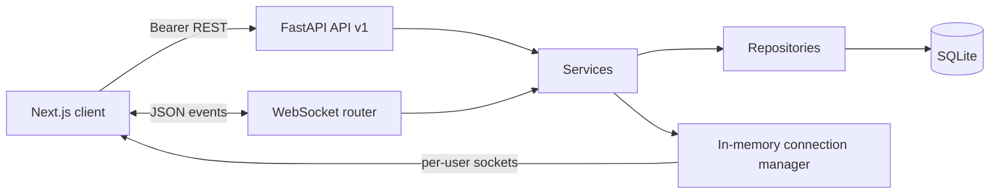
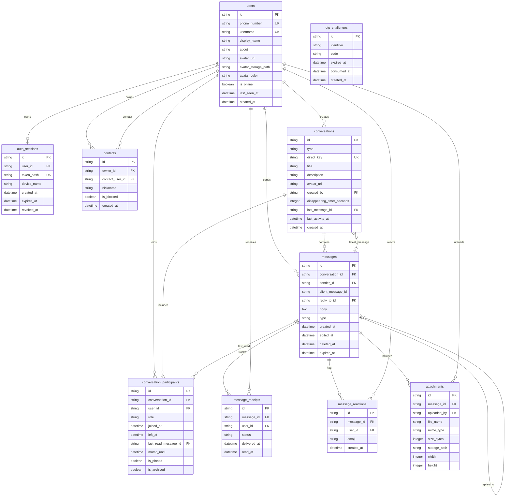
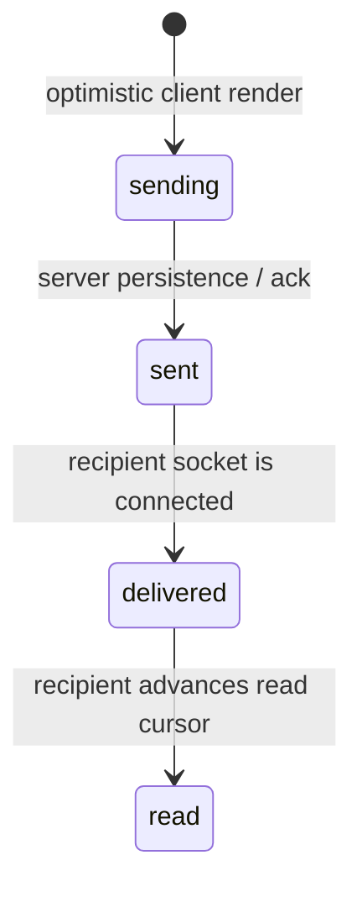

# Signal Clone

A full-stack desktop-style messaging demo built with Next.js, FastAPI, SQLAlchemy, and SQLite. It includes onboarding, contacts, direct and group conversations, persisted messages, realtime delivery/read status, typing and presence events, uploads, reactions, replies, disappearing timers, and light/dark themes.

**Screenshots:** [curated responsive UI captures](docs/screenshots/README.md) show representative phone and desktop layouts in light and dark themes. Full Playwright captures go to the ignored `frontend/test-results/screenshots/`; `npm run screenshots` intentionally refreshes the curated set.

## Demo accounts

Sign in as `+91 90000 00001` or `+91 90000 00002` and enter the fixed OTP `123456`. Use a second browser profile for the other account. The app seeds ten realistic users and sample conversations the first time an empty database starts.

## Technology choices

- **Next.js 14 App Router + strict TypeScript:** route layouts keep onboarding and the authenticated messaging shell separate.
- **Tailwind CSS + CSS variables:** Tailwind is available for utility styling; CSS variables provide shared Signal-like light and dark tokens.
- **Zustand + TanStack Query:** Zustand owns session and short-lived UI/realtime state; Query owns REST-backed lists and message pages.
- **Native WebSocket wrapper:** keeps the event protocol small, reconnects with backoff, and resynchronizes active conversations through REST.
- **FastAPI + Pydantic v2 + SQLAlchemy 2:** typed HTTP/WebSocket boundaries with explicit services and repositories.
- **SQLite:** simple local persistence with foreign keys and WAL; suitable for a single backend instance in this demo.

## Local setup

Requirements: Python 3.11, Node.js 20.19+, and npm. In PowerShell, confirm the Python launcher sees 3.11 with `py -3.11 --version` before creating the virtual environment.

### Backend

```powershell
cd backend
py -3.11 -m venv .venv
.\.venv\Scripts\Activate.ps1
python -m pip install --upgrade pip
python -m pip install -r requirements.txt
Copy-Item .env.example .env
uvicorn app.main:app --reload --env-file .env
```

At startup the backend creates the schema from the SQLAlchemy models and seeds an empty database. Local defaults are `sqlite:///./signal.db`, `uploads/`, `OTP_CODE=123456`, and CORS origin `http://localhost:3000`. API docs are at [http://localhost:8000/docs](http://localhost:8000/docs); health is at [http://localhost:8000/health](http://localhost:8000/health).

### Frontend

In a second terminal:

```powershell
cd frontend
Copy-Item .env.example .env.local
npm ci
npm run dev
```

Open [http://localhost:3000](http://localhost:3000). The example frontend URLs target the local backend at `http://localhost:8000/api/v1` and `ws://localhost:8000/ws`.

### Environment variables

| Variable | Service | Example / purpose |
|---|---|---|
| `DATABASE_URL` | Backend | `sqlite:///./signal.db`; optional paid Render disk: `sqlite:////data/signal.db` |
| `CORS_ORIGINS` | Backend | Comma-separated exact web origins, such as `http://localhost:3000` |
| `UPLOAD_DIR` | Backend | `uploads`; optional paid Render disk: `/data/uploads` |
| `OTP_CODE` | Backend | Mock verification code; the public demo uses `123456` |
| `ENVIRONMENT` | Backend | `development` locally; `production` activates production checks |
| `JWT_SECRET` | Backend | Required in production; set a unique random value of at least 32 characters |
| `MAX_UPLOAD_BYTES` | Backend | Upload cap in bytes; defaults to `10485760` (10 MiB) |
| `NEXT_PUBLIC_API_URL` | Frontend | API root including `/api/v1` |
| `NEXT_PUBLIC_WS_URL` | Frontend | WebSocket endpoint; use `wss://` in production |

## Architecture



Backend request flow is **API/WebSocket handler → service → repository → model**. Handlers parse inputs and authenticate; services enforce membership, sender ownership, admin roles, idempotency, receipts, and expiry; repositories issue focused database access without embedding policy. Pydantic schemas define request/response boundaries. The frontend keeps network code in `src/lib/` and feature hooks; presentational UI renders props and state rather than opening sockets.

## Database schema

Primary and foreign keys use UUID strings. Timestamps are UTC datetimes. SQLite connections enable `PRAGMA foreign_keys=ON` and WAL mode.



### Constraints and indexes

- `users` requires at least a phone number or username; both identifiers are unique when present.
- `contacts` is unique per owner/contact pair and rejects self-contact.
- `conversations.direct_key` is unique for the sorted pair of users, preventing duplicate direct chats. Conversation type, message type, role, and receipt status are checked against allowed values.
- `conversation_participants` is unique per conversation/user; `message_receipts` and `message_reactions` are unique per message/user. A sender/client-message key makes sends idempotent.
- Foreign keys cascade when deleting owned sessions, conversation membership, receipts, reactions, or attachments where appropriate. Messages are soft-deleted for everyone by setting `deleted_at`.
- Conversation activity is indexed for list ordering. Participant `user_id` supports membership lookup. Message history has a `(conversation_id, created_at DESC)` index; expiry and receipt lookup columns are indexed for background purge and status aggregation.

## REST API overview

Prefix: `/api/v1`. Routes require `Authorization: Bearer <token>` except OTP request/verification. Errors use `{ "error": { "code": "...", "message": "..." } }`.

| Area | Endpoints |
|---|---|
| Auth | `POST /auth/request-otp`, `POST /auth/verify-otp`, `PUT /auth/profile`, `POST /auth/logout`, `GET /auth/me` |
| Users | `GET /users/search?q=`, `PATCH /users/me`, `POST /users/me/avatar` |
| Contacts | `GET /contacts`, `POST /contacts`, `DELETE /contacts/{contact_id}`, `POST /contacts/{contact_id}/block`, `PUT /contacts/{contact_id}/block`, `PUT /contacts/users/{user_id}/block` |
| Conversations | `GET /conversations?q=`, `POST /conversations/direct`, `GET /conversations/{id}`, `POST /conversations/{id}/read`, `PATCH /conversations/{id}` |
| Messages | `GET /conversations/{id}/messages?before=&limit=`, `POST /conversations/{id}/messages`, `DELETE /messages/{id}`, `PUT /messages/{id}/reaction`, `DELETE /messages/{id}/reaction` |
| Groups | `POST /groups`, `GET /groups/{id}/members`, `POST /groups/{id}/members`, `DELETE /groups/{id}/members/{user_id}`, `PATCH /groups/{id}/members/{user_id}/role`, `PATCH /groups/{id}` |
| Uploads/media/system | `POST /uploads`, authenticated `GET /media/attachments/{id}`, authenticated `GET /media/avatars/{user_id}`, `GET /health` (outside the API prefix), interactive `/docs` |

Cursor history is returned oldest-to-newest within each page; the UI requests older pages using the first message ID as `before`. Group membership and role checks happen in backend services, not only in the UI.

Authentication limits are per source address and normalized identifier: OTP requests are limited to 5 per 10 minutes and verification attempts to 10 per 10 minutes. The backend also applies per-address caps. Message bodies are limited to 10,000 characters, and uploads default to 10 MiB (`MAX_UPLOAD_BYTES`).

## WebSocket protocol

Connect to `/ws?token=<bearer-token>`. Each frame has `{ "type": "event.name", "payload": { ... } }`.

| Direction | Event | Purpose |
|---|---|---|
| Client → server | `message.send` | Persist an idempotent message with `client_message_id` |
| Client → server | `typing.start`, `typing.stop` | Debounced typing state, membership checked and server-throttled |
| Client → server | `message.delivered` | Acknowledge delivery to a recipient |
| Client → server | `conversation.read` | Advance read cursor and publish read receipts |
| Client → server | `reaction.set`, `reaction.remove` | Replace or remove the current user's reaction |
| Client → server | `ping` | Keep the connection alive; server answers `pong` |
| Server → client | `message.new`, `message.ack` | Deliver message and acknowledge sender's client ID |
| Server → client | `message.status` | Per-recipient and aggregate delivery/read update |
| Server → client | `typing`, `presence` | Typing state and online/last-seen changes |
| Server → client | `conversation.updated` | `{conversation_id}`; clients invalidate and reload group metadata |
| Server → client | `reaction.updated`, `message.deleted` | Refresh message reactions or remove expired/deleted message |
| Server → client | `error`, `pong` | Report invalid event or answer heartbeat |

The connection manager supports multiple sockets per user. First connect marks online and delivers pending receipts; cleanup in `finally` records `last_seen_at` when the final socket exits. A 75-second heartbeat timeout drops stale sockets; the browser pings every 25 seconds, reconnects with exponential backoff, and invalidates REST queries to resync. Expired/revoked WebSocket credentials clear the client session instead of retrying forever.

### Message status state machine



For groups, the aggregate considers current participants (`left_at IS NULL`): it remains `sent` while any current recipient is pending, becomes `delivered` after every current recipient is delivered, and becomes `read` after every current recipient reads. A client-only `sending` state is never persisted.

## Feature checklist

- [x] Welcome, fixed-code registration, profile/avatar onboarding, persisted session validation, logout.
- [x] Conversation list/search, contacts, direct chats, group creation and role-managed membership.
- [x] Realtime two-way messages, optimistic sending, idempotency, receipts, read cursors, typing, presence, reconnect/resync.
- [x] Pagination, date dividers, grouped bubbles, replies, reactions, attachments/image preview, disappearing-message purge/timer UI.
- [x] Privacy/notification/appearance settings, persistent light/dark preference, responsive single-pane mobile chat, keyboard shortcuts, accessibility focus handling.
- [x] Backend layering, SQLite indexes/constraints, model-driven schema creation, startup seed, REST/WebSocket tests, live two-account smoke script, Render/Vercel config, CI.

## Assumptions and simulated parts

- OTP is always the configured mock code (default `123456`); no SMS provider is contacted.
- Session tokens are random opaque bearer values stored as SHA-256 hashes with expiry/revocation; they are not JWTs. This keeps session validation explicit for both REST and WebSockets.
- `JWT_SECRET` is required for a production-mode startup as a deployment secret check; it is not used to sign these opaque database-backed session tokens.
- “End-to-end encrypted” is UI copy only. There is no cryptographic message encryption or key exchange.
- Calls, Stories, and linked devices are “Coming Soon” placeholders. Notifications are in-app toasts; there is no push service.
- Avatar colors are deterministic user fields; avatar and attachment bytes are stored on the configured upload directory and delivered only through authenticated media routes. Attachment routes require active conversation membership; avatar routes require self or contact access.
- SQLite and the WebSocket connection manager are single-instance choices. A multi-instance deployment would need a shared database and pub/sub connection broker.
- Seed data runs only for an empty users table. The development OTP and demo accounts are intentionally predictable.

## Deployment

See [DEPLOY.md](DEPLOY.md) for the Render and Vercel setup sequence. The Render free service has an ephemeral filesystem: SQLite data and uploaded files reset after a restart, spin-down, or redeploy, and startup recreates the demo seed. A persistent disk mounted at `/data` is an optional paid-plan configuration. Vercel must set `NEXT_PUBLIC_API_URL` at build time; `NEXT_PUBLIC_WS_URL` is optional and derives `ws://` or `wss://` from the API URL. Set backend `CORS_ORIGINS` to the exact deployed frontend origin.

## Tests and verification

Backend tests use an in-memory SQLite database with `StaticPool`, dependency overrides, and `TESTING=1` so lifespan seed/background tasks do not run in tests:

```powershell
cd backend
python -m pytest -x -q
```

Frontend checks:

```powershell
cd frontend
npm ci
npm run format:check
npm run lint
npm run typecheck
npm run build
```

The live local smoke script exercises both demo accounts over HTTP and WebSockets. Start the backend first, then run `python scripts/smoke_e2e.py`. For post-restart checks, use `--verify-conversation`, `--verify-message`, and `--verify-group` with the IDs printed by the first run. GitHub Actions runs backend pytest and frontend install, formatting, lint, typecheck, and build on pushes and pull requests.

## Mobile and installable web app

The web app uses a single-pane chat layout below 768px, full-screen chat/profile/settings pages, safe-area spacing, and a standalone PWA manifest with original Signal-blue chat-bubble icons. On supported browsers use **Add to Home Screen** or **Install app**. Playwright mobile captures go to the ignored `frontend/test-results/screenshots/mobile/` directory.

Keyboard shortcuts: `Ctrl/Cmd+F` focuses chat search, `Ctrl/Cmd+N` opens New message, `Esc` closes the active dialog or panel, and `Alt+Arrow Up/Down` moves between chats.

## Known limitations

- One SQLite file and one in-memory WebSocket hub serve a single process; horizontal scaling and cross-device delivery need shared infrastructure.
- Upload checks enforce type and size, but files are not scanned and media storage is local/disk-backed.
- The mock OTP, simulated encryption, and demo seed make this a learning/evaluation project, not a production private messenger.
