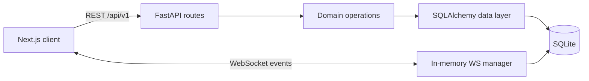

# Signal Clone

A full stack messaging demo inspired by Signal Desktop. The project uses a Next.js App Router client and a FastAPI + SQLAlchemy backend backed by SQLite. Screenshots: _add a screenshot of the running app here_.

## Demo

Use **+91 90000 00001** or **+91 90000 00002**, then enter OTP **123456**. The app seeds 10 demo users, conversations, groups, and chat history on first startup. There is no real phone delivery.

## Stack and architecture

- Next.js 14, React, TypeScript strict, Tailwind, Zustand/TanStack Query dependencies, Lucide icons.
- FastAPI, Pydantic v2, SQLAlchemy 2, SQLite with FK enforcement and WAL, native WebSockets.
- SQLite is intentionally simple for a local assignment; use a persistent disk in hosted environments.



Route handlers validate input and authenticate, then call domain helpers; SQLAlchemy entities are the persistence boundary. The compact starter currently keeps several helpers/models in `backend/app/main.py`; expand them into the repository/service modules as the feature set grows. UI state lives in React component state today; Zustand and TanStack Query are installed for the next extraction pass.

## Setup

Backend (Python 3.11+):

```powershell
cd backend
python -m venv .venv
.\.venv\Scripts\Activate.ps1
pip install -r requirements.txt
Copy-Item .env.example .env
uvicorn app.main:app --reload
```

Frontend (Node 20+), in a second terminal:

```powershell
cd frontend
Copy-Item .env.example .env.local
npm install
npm run dev
```

Open http://localhost:3000. API docs are at http://localhost:8000/docs and health is at http://localhost:8000/health. Config: backend `DATABASE_URL`, `JWT_SECRET`, comma-separated `CORS_ORIGINS`, `UPLOAD_DIR`, `OTP_CODE`; frontend `NEXT_PUBLIC_API_URL`, `NEXT_PUBLIC_WS_URL`.

Run backend tests: `cd backend; pytest`. Frontend checks: `cd frontend; npm run typecheck; npm run build`.

## Database schema

```mermaid
erDiagram
  users ||--o{ auth_sessions : owns
  users ||--o{ contacts : owner
  users ||--o{ conversation_participants : joins
  conversations ||--o{ conversation_participants : includes
  conversations ||--o{ messages : contains
  users ||--o{ messages : sends
  messages ||--o{ message_receipts : tracks
  messages ||--o{ message_reactions : receives
  messages ||--o{ attachments : contains
  users { string id PK; string phone_number UK; string username UK; string display_name; string about; string avatar_url; string avatar_color; boolean is_online; datetime last_seen_at; datetime created_at }
  auth_sessions { string id PK; string user_id FK; string token_hash UK; datetime expires_at; datetime revoked_at }
  contacts { string id PK; string owner_id FK; string contact_user_id FK; boolean is_blocked }
  conversations { string id PK; string type; string title; string direct_key UK; string created_by FK; datetime last_activity_at }
  conversation_participants { string id PK; string conversation_id FK; string user_id FK; string role; datetime last_read_at }
  messages { string id PK; string conversation_id FK; string sender_id FK; string client_message_id; text body; datetime created_at }
  message_receipts { string id PK; string message_id FK; string user_id FK; string status }
```

FK cascades clean up membership/messages/receipts; uniqueness constraints prevent duplicate direct chats, participant membership, receipt rows, and sender idempotency keys. Indexes cover conversation activity, participant lookup, and message history by conversation/time. Timestamp storage uses UTC-aware Python datetimes. The current seed schema includes users, OTP, conversations, participants, messages, and receipts; auth sessions, persistent contacts, reactions, and attachment tables are not yet implemented.

## API overview

| Area | Routes |
|---|---|
| Auth | `POST /auth/request-otp`, `POST /auth/verify-otp`, `GET /auth/me`, `PUT /auth/profile`, `POST /auth/logout` |
| Users | `GET /users/search`, `PATCH /users/me` |
| Contacts | `GET /contacts`, `POST /contacts` (starter lookup flow) |
| Conversations | `GET /conversations`, `POST /conversations/direct`, `GET /conversations/{id}`, `PATCH /conversations/{id}`, `POST /conversations/{id}/read` |
| Messages | `GET /conversations/{id}/messages`, `POST /conversations/{id}/messages`, `PATCH /messages/{id}` |
| Groups | `POST /groups`, `GET /groups/{id}/members`, `POST /groups/{id}/members`, `DELETE /groups/{id}/members/{user_id}` |
| System | `GET /health`, interactive `/docs`, WebSocket `/ws?token=...` |

## WebSocket events

| Direction | Events |
|---|---|
| Client → server | `ping`, `message.send`, `typing.start`, `typing.stop`, `conversation.read` |
| Server → client | `pong`, `message.new`, `message.ack`, `message.status`, `typing`, `error` |

Messages are idempotent on `(sender_id, client_message_id)`. The client renders an optimistic `sending` bubble, then uses the REST result / `message.ack`. Intended state progression: `sending → sent → delivered → read`; initial implementation persists and broadcasts messages and read updates, while delivery aggregation is a simplified scaffold.

## Feature checklist

- [x] Mock OTP onboarding and profile name; persistent browser token.
- [x] Demo seed, direct conversations, message history, REST send, basic WebSocket delivery, group creation and admin-protected member additions.
- [x] Responsive two-pane messaging shell, search, avatar colors/initials, dark/light toggle, calls placeholder, encryption explanation, settings and logout.
- [ ] Full contact/block management, membership role editing, receipt aggregation and presence fanout.
- [ ] Uploads, reactions, reply quoting, disappearing-message purge, typing expiry, full keyboard shortcuts and production reconnect/resync.
- [ ] Extract all UI/state/API/model layers into the prescribed individual component and service files; current UI intentionally prioritizes a compact working demo.

## Assumptions and simulated behavior

- The OTP is fixed to `123456`; this is a local demonstration flow, not phone verification.
- The bearer token is an opaque demo token encoded as `demo-<user id>` for transparent local auth. Configure a real secret and replace this with signed/hashed sessions before real deployment.
- Encryption is represented by a user-facing explanation only. No cryptography, calls, Stories, or linked devices are implemented.
- Seed generation runs only when the users table is empty. SQLite and the in-memory WebSocket hub target a single backend process.
- The first two seeded phone accounts let evaluators open two browser profiles and exchange messages.

## Deployment

Frontend can be deployed to Vercel; backend uses `render.yaml` and Docker. Set production `NEXT_PUBLIC_API_URL` and `NEXT_PUBLIC_WS_URL` (`wss://.../ws`), and set backend `CORS_ORIGINS` to the Vercel origin. Attach a Render persistent disk at `/data` and use `DATABASE_URL=sqlite:////data/signal.db`; otherwise an ephemeral deployment resets its database. A production deployment should replace the demo auth token, use TLS, and review upload limits and multi-worker WebSocket fanout.

## Known limitations

This is a functional foundation and messaging demo rather than a full Signal replacement. It does not provide E2E encryption, actual phone OTP, auth-session revocation, upload storage, reactions, edit/delete-for-everyone semantics, complete contact CRUD, full typing/presence behavior, attachment delivery, or disappearing-message cleanup. Group member additions enforce the admin rule server-side; removal supports self-leave or admin removal. Keep it on trusted development environments until authentication is upgraded.
