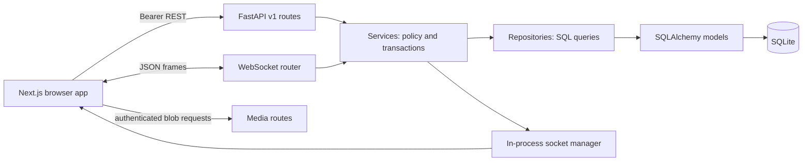
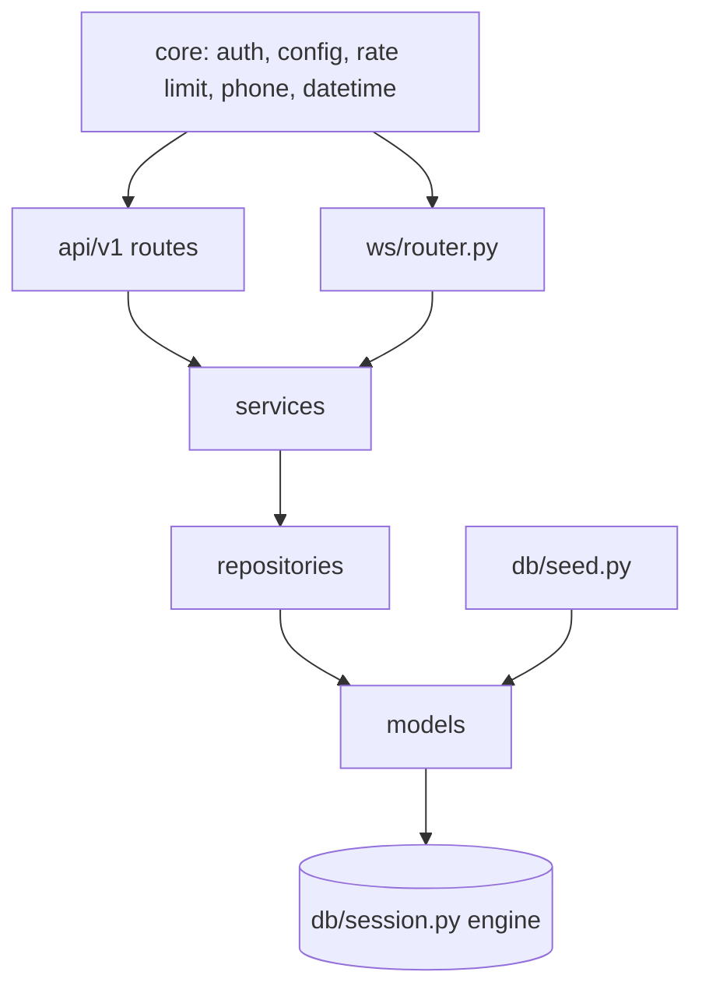
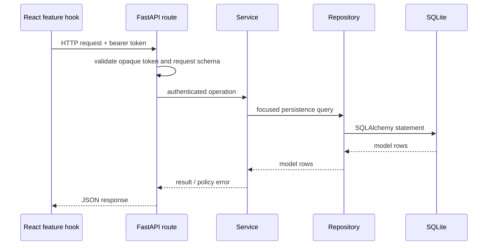
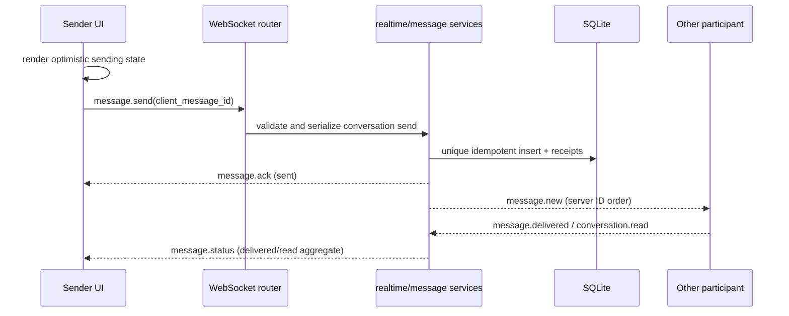
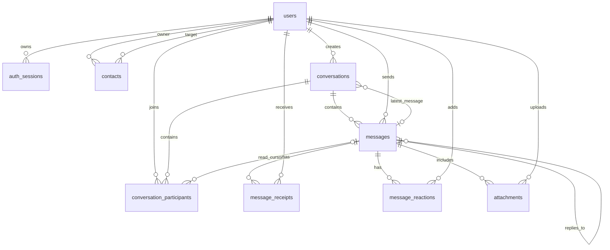

# As-built architecture

This document records the current implementation, not a promise of production Signal security. The backend is FastAPI + SQLAlchemy + SQLite; the frontend is Next.js 14 + TypeScript.

## System and backend layers

REST handlers in `backend/app/api/v1/` perform dependency-based authentication and schema validation, then call `services/`; services enforce membership, admin and ownership rules and use `repositories/` for queries. `app/ws/router.py` validates the opaque session token, dispatches frames to services, and uses `ws/manager.py` for per-user sockets. `schemas/` are Pydantic boundaries. `core/` contains settings, auth dependencies, rate limiting, datetime/phone normalization and security helpers. `db/` creates model metadata and seeds an empty database during lifespan startup.

## Frontend modules and request lifecycle

`src/app/` owns onboarding, chat and settings routes. `components/` is feature-grouped into chat, contacts, conversations, groups, layout, settings and UI primitives. `hooks/` own query/realtime orchestration, `lib/` owns REST/WebSocket/formatting/normalization helpers, and Zustand stores hold the session and transient UI/chat/presence state. TanStack Query owns server-backed conversations and message history.

## Authentication, message and reconnect paths

- OTP is mocked. `POST /auth/request-otp` canonicalizes phone identifiers and returns `demo_code`; verification consumes a challenge, finds or creates one user, and returns a random opaque bearer token. Only its SHA-256 hash is persisted in `auth_sessions`; expiry is 30 days and logout sets `revoked_at`. There are no JWTs despite the `JWT_SECRET` production-startup guard.
- The browser persists token/user in localStorage through `authStore`. `AppShell` calls `GET /auth/me` when loaded. `api.ts` clears a stored session centrally on authenticated 401 and carries a one-time sign-in notice to `/welcome`. WebSocket unauthorized close also clears the session.
- Message send is optimistic in `useMessages`, then uses WebSocket where connected and REST as fallback. `realtime_service.send_message` serializes same-conversation/idempotency-key writes, persists once by `(sender_id, client_message_id)`, acknowledges the sender, broadcasts by server-assigned message ID, and publishes delivered/read receipt aggregates. Conversation list preview updates optimistically and is invalidated on realtime events.
- Typing is membership-checked, rate-limited per conversation and client-expired after five seconds. Presence is process-local and counts all sockets/tabs for a user. First connect sends `presence.snapshot`, then broadcasts live state to shared contacts/conversations. Last disconnect remains online during a five-second grace; reconnect cancels that pending offline transition.
- WebSocket reconnect uses exponential backoff. On reconnect, the client invalidates the conversation query and active REST message history to resync. The 75-second server heartbeat sweeper drops stale sockets; clients ping every 25 seconds.
- Disappearing messages are purged by the lifespan task every two seconds, soft-deleted in SQLite and broadcast as `message.deleted`.

## Database schema and ER diagram

All IDs are UUID strings. SQLite enables foreign keys, WAL and a 30-second busy timeout. Models are the schema source; `create_all` runs on startup and `seed_if_empty` populates only an empty users table. UTC-aware Python timestamps are serialized as ISO 8601 UTC with `Z`.

| Table | Main columns and rules |
|---|---|
| `users` | `id` PK; unique nullable `phone_number`, unique nullable `username`; profile, online and last-seen fields; CHECK phone or username exists. |
| `auth_sessions` | `id` PK; `user_id` FK cascade/index; unique indexed `token_hash`; device, created, expiry/index, revoked. |
| `otp_challenges` | `id` PK; indexed identifier, code, expiry, consumed and created times. |
| `contacts` | `id` PK; owner/contact user FKs cascade/indexed; nickname, blocked, created; unique owner/user and no-self CHECK. |
| `conversations` | `id` PK; type CHECK, creator FK, unique nullable direct key, group fields, timer, last-message FK, activity/index and created time. |
| `conversation_participants` | `id` PK; conversation/user FKs, role CHECK, unique pair; joined/left, read-cursor FK, mute, archived and pinned. |
| `messages` | `id` PK; conversation FK cascade/index, sender FK; body/type CHECK, reply self-FK, sender/client ID unique, created/edited/deleted/expiry/index. |
| `message_receipts` | `id` PK; message/user FKs cascade/index, status CHECK, unique message/user, delivered/read times. |
| `message_reactions` | `id` PK; message/user FKs cascade/index, unique message/user, emoji and created time. |
| `attachments` | `id` PK; nullable message FK cascade/index and uploader FK cascade/index; filename, MIME, size-positive CHECK, storage path and image dimensions. |

## API and WebSocket contracts

REST base is `/api/v1`; all routes require a bearer session except OTP request and verification. `GET /health` is outside the prefix.

| Area | Implemented routes |
|---|---|
| Auth | `POST /auth/request-otp`, `POST /auth/verify-otp`, `GET /auth/me`, `PUT /auth/profile`, `POST /auth/logout` |
| Users / contacts | `GET /users/search`, `PATCH /users/me`, `POST/DELETE /users/me/avatar`, `GET/POST /contacts`, `DELETE /contacts/{id}`, `POST/PUT /contacts/{id}/block`, `PUT /contacts/users/{user_id}/block` |
| Conversations / messages | `GET /conversations`, `POST /conversations/direct`, `GET /conversations/{id}`, `POST /conversations/{id}/read`, `PATCH /conversations/{id}`, `GET/POST /conversations/{id}/messages`, `DELETE /messages/{id}`, `PUT/DELETE /messages/{id}/reaction` |
| Groups / files | `POST /groups`, `GET/POST /groups/{id}/members`, `DELETE /groups/{id}/members/{user_id}`, `PATCH /groups/{id}/members/{user_id}/role`, `PATCH /groups/{id}`, `POST /uploads`, authenticated `GET /media/attachments/{id}`, `GET /media/conversations/{id}/attachments`, `GET /media/avatars/{user_id}` |

Connect WebSocket at `/ws?token=...`. Every frame uses `{type,payload}`.

| Direction | Events |
|---|---|
| Client → server | `ping`, `message.send`, `message.delivered`, `conversation.read`, `typing.start`, `typing.stop`, `reaction.set`, `reaction.remove` |
| Server → client | `pong`, `presence.snapshot`, `presence`, `message.new`, `message.ack`, `message.status`, `typing`, `conversation.updated`, `reaction.updated`, `message.deleted`, `error` |

## Design decisions and known limitations

- No migration framework is used; fresh schema comes from SQLAlchemy metadata. Existing database files are not automatically upgraded in a defined migration sequence.
- SQLite and the in-memory socket manager/rate limiter are single-process demo choices. Horizontal scaling, multiple Render instances and shared online state need shared infrastructure.
- Render Free has an ephemeral filesystem and cold starts; schema and demo seed return after a reset, but user-created data and uploaded files do not.
- OTP is fixed/configurable demo behavior with no SMS; “end-to-end encrypted” is presentation copy, not cryptography. Calls, Stories and linked devices are placeholders.
- There are automated unit, API, WebSocket, Playwright and smoke checks, but no real Signal Desktop reference images in `docs/reference/`; exact visual parity is not demonstrated.

See [README.md](../README.md) for setup, feature checklist and test commands; [DEPLOY.md](../DEPLOY.md) for dashboard deployment steps.
